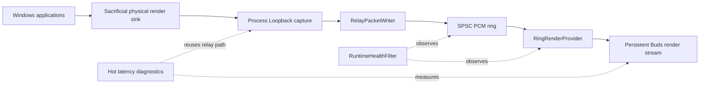

# Legacy V0.1 — Process Loopback Keepalive Relay

**Status:** frozen historical implementation  
**Frozen on:** 2026-09-27  
**Canonical source revision:** `57d56afbc75453d2018fa379972bf2cab071fa27`

V0.1 is the first known-good daily Windows LE Audio relay baseline. It is preserved here unchanged as evidence and as a behavioral reference for the Round4 rewrite. New production code must not import or depend on this directory.

## What V0.1 does

- Captures the Windows system mix through Process Loopback while excluding the relay process tree.
- Requires a sacrificial physical Windows default render sink; the Buds endpoint is not the default system sink.
- Keeps one shared-mode Galaxy Buds3 Pro render stream alive continuously.
- Emits real zero PCM while the relay is not actively consuming captured audio.
- Relays 48 kHz / Float32 / stereo PCM through a single SPSC ring.
- Uses KEEPALIVE → ARMED → RELAY startup states so the first destination read begins with a target cushion.
- Collects runtime underrun/overflow/callback counters and emits filtered warnings.
- Includes a hot latency laboratory that injects chirps through a sacrificial sink and correlates Process Loopback and microphone capture timing.

## Architecture



## Important implementation invariants

1. The Buds destination stream starts before Process Loopback capture.
2. The destination stream stays alive during KEEPALIVE by returning real zero-filled PCM.
3. Capture is the ring producer; render is the ring consumer.
4. Startup activation waits for the current render request plus the target cushion before entering RELAY.
5. V0.1 has no outer product lifecycle supervisor. One process invocation owns one audio route lifetime.
6. Runtime health is observational. Warnings do not rebuild a failed or stale route.

## Actual category behavior

The V0.1 code accepts `--category game-effects`, `media`, `game-media`, `other`, or `default`.

Although later daily-operation decisions preferred **GameEffects**, the frozen code still treats an omitted `--category` as **Default / unset**. The archive records implementation reality rather than rewriting it to match later intent.

## Long-run observations discovered after the baseline was frozen

These are operational observations, not root-cause claims:

- Device disconnect/reconnect and Windows suspend/resume require manual process restart because V0.1 has no lifecycle supervisor.
- Large `OverflowFrames` totals were observed without correspondingly obvious audible loss or latency growth. The counter combines dropped runtime writes, including silent zero frames, so its product meaning is insufficiently specific.
- After many days of repeated sleep/wake and manual relay restarts, rare periodic micro-dropouts could occur under information-dense audio; a full Windows reboot restored normal behavior.

These observations motivate the Round4 architecture but do not modify V0.1.

## Build the archive

From this directory:

```powershell
dotnet build .\LEKeepAliveRelay.csproj
```

The archive remains buildable for regression and historical experiments, but it is not the canonical implementation after Round4.

## Frozen VF knowledge base

See [VF/README.md](VF/README.md). The VF-KB sources pin the original immutable baseline revision rather than this archive path, so evidence does not drift when the repository is reorganized.
