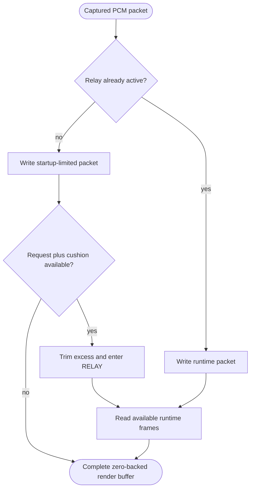

<!--vf:node
schema "vf-kb/0.1"
id "leaudio-router.v0-1.buffer-boundary"
kind "behavior"
parent "leaudio-router.v0-1.relay-session"
coverage "mapped"
-->

<!--vf:summary
entry "Captured 48 kHz stereo packets arrive at RelayPacketWriter while destination render callbacks request frames from RingRenderProvider."
problem "Capture and render timing require one elastic boundary while the destination must still receive real zero PCM before relay activation or during underrun."
behavior "Write captured audio or zeros into an SPSC ring, hold startup data to a bounded fill, activate relay only after request-plus-cushion is available, and zero-fill missing runtime reads."
exit "Each render callback returns a complete buffer while ring occupancy and dropped/missing frame counters record the boundary behavior."
-->

<!--vf:source
id "ring"
repo "STanJK/le-audio-windows-relay"
rev "57d56afbc75453d2018fa379972bf2cab071fa27"
path "Audio/SpscPcmRing.cs"
symbol "SpscPcmRing"
-->

<!--vf:source
id "provider"
repo "STanJK/le-audio-windows-relay"
rev "57d56afbc75453d2018fa379972bf2cab071fa27"
path "Audio/RingRenderProvider.cs"
symbol "RingRenderProvider"
-->

<!--vf:source
id "writer"
repo "STanJK/le-audio-windows-relay"
rev "57d56afbc75453d2018fa379972bf2cab071fa27"
path "Audio/RelayPacketWriter.cs"
symbol "RelayPacketWriter"
-->

<!--vf:source
id "options"
repo "STanJK/le-audio-windows-relay"
rev "57d56afbc75453d2018fa379972bf2cab071fa27"
path "Config/RelayOptions.cs"
symbol "RelayOptions"
-->

<!--vf:claim
id "activation-requires-request-plus-cushion"
type "fact"
text "ARMED switches to RELAY only when observed ring fill is at least the current render request plus the configured target cushion."
evidence "provider"
-->

<!--vf:claim
id "missing-runtime-frames-are-zero-filled"
type "fact"
text "Every render callback clears its output buffer first, reads available ring frames, and leaves any missing runtime frames as real zero PCM."
evidence "provider"
-->

<!--vf:claim
id "overflow-counter-mixes-audio-and-silent-writes"
type "fact"
text "Runtime audio writes and runtime zero writes both add rejected frames to the same SpscPcmRing OverflowFrames counter."
evidence "ring"
evidence "writer"
-->

**Why:** V0.1 needs one elastic PCM boundary between Process Loopback production and destination rendering without ever starving the destination callback of a complete buffer. [explain →](./v0.1.fact.md#buffer-boundary-why)

**What:** The boundary uses a bounded SPSC ring, a startup cushion gate, and real zero-fill for keepalive and missing runtime frames. [explain →](./v0.1.fact.md#buffer-boundary-what)

**Outcome:** Render always receives a complete buffer, while fill, dropped writes, startup trims, and underrun zero-fill remain observable as counters. [explain →](./v0.1.fact.md#buffer-boundary-outcome)



<!--vf:pseudocode
node leaudio-router.v0-1.buffer-boundary
flow ring-control
audience human
purpose "Linear reading companion to the Mermaid flow; ignored by AI context by default."
-->
```text
ON each capture packet:
    IF relay is active:
        write audio or zero frames with the full ring capacity as the limit
    ELSE:
        write audio or zero frames only up to the startup hold limit

ON each destination render request:
    clear the whole destination buffer to real zeros

    IF mode is ARMED:
        required = current request + target cushion
        IF ring fill >= required:
            discard excess above required
            switch to RELAY

    IF mode is RELAY:
        read as many requested frames as are available
        leave any missing frames as zeros
    ELSE:
        return the zero keepalive buffer
```
<!--vf:end-->
