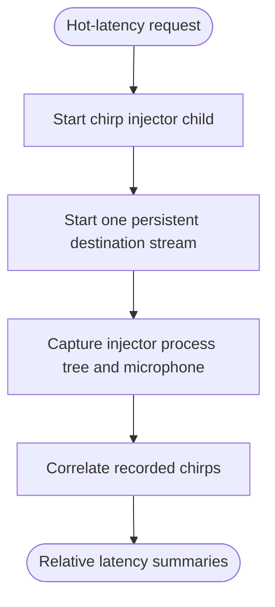

<!--vf:node
schema "vf-kb/0.1"
id "leaudio-router.v0-1.hot-latency-probe"
kind "behavior"
parent "leaudio-router.v0-1"
coverage "mapped"
-->

<!--vf:summary
entry "An explicit --hot-latency invocation supplies or defaults a Buds destination, sacrificial injector sink, USB microphone, run count, and audio category."
problem "The project needs repeatable hot-path relative timing measurements without tearing down the destination stream between chirps."
behavior "Spawn an injector child, capture only that child through Process Loopback, keep one destination stream active, record microphone timing, correlate chirps, and summarize source-to-loop and loop-to-microphone intervals."
exit "Accepted correlation hits are printed as per-run measurements and median/min/max summaries, followed by final ring diagnostics."
-->

<!--vf:source
id "probe"
repo "STanJK/le-audio-windows-relay"
rev "57d56afbc75453d2018fa379972bf2cab071fa27"
path "Diagnostics/ProcessLoopbackLatencyProbe.cs"
symbol "ProcessLoopbackLatencyProbe"
-->

<!--vf:source
id "injector"
repo "STanJK/le-audio-windows-relay"
rev "57d56afbc75453d2018fa379972bf2cab071fa27"
path "Diagnostics/Latency/InjectorWorker.cs"
symbol "InjectorWorker"
-->

<!--vf:source
id "signal"
repo "STanJK/le-audio-windows-relay"
rev "57d56afbc75453d2018fa379972bf2cab071fa27"
path "Diagnostics/Latency/SignalGenerator.cs"
symbol "SignalGenerator"
-->

<!--vf:source
id "correlation"
repo "STanJK/le-audio-windows-relay"
rev "57d56afbc75453d2018fa379972bf2cab071fa27"
path "Diagnostics/Latency/CorrelationAnalyzer.cs"
symbol "CorrelationAnalyzer"
-->

<!--vf:claim
id "probe-keeps-one-destination-stream"
type "fact"
text "The hot-latency probe starts one destination player before the measurement sequence and stops it only after the injector sequence and capture tail finish."
evidence "probe"
-->

<!--vf:claim
id "probe-captures-injector-process-tree"
type "fact"
text "The hot-latency probe creates Process Loopback capture in IncludeTargetProcessTree mode for the injector child process."
evidence "probe"
-->

<!--vf:claim
id "probe-reports-relative-timing-components"
type "fact"
text "Accepted chirp correlations are reported as SRC-to-LOOP, LOOP-to-MIC, and SRC-to-MIC intervals with median and min/max summaries."
evidence "probe"
evidence "correlation"
-->

**Why:** The project needs a hot-path A/B tool that can compare routing/category behavior while keeping the final destination stream alive across repeated measurements. [explain →](./v0.1.fact.md#hot-probe-why)

**What:** The probe injects timed chirps into a sacrificial sink, captures only the injector process tree, relays to Buds, captures a microphone, and correlates both recorded paths against the chirp reference. [explain →](./v0.1.fact.md#hot-probe-what)

**Outcome:** The tool emits repeatable relative timing components and basic final ring diagnostics without claiming a separately calibrated absolute acoustic end-to-end latency. [explain →](./v0.1.fact.md#hot-probe-outcome)



<!--vf:pseudocode
node leaudio-router.v0-1.hot-latency-probe
flow hot-measurement
audience human
purpose "Linear reading companion to the Mermaid flow; ignored by AI context by default."
-->
```text
START hot-latency probe:
    resolve Buds destination and microphone
    spawn one injector child targeting the sacrificial sink
    create Process Loopback capture including only the injector process tree

    start one persistent Buds destination stream
    arm the relay
    start microphone and loopback capture
    release the injector to emit repeated chirps

    after the sequence:
        correlate chirps in Process Loopback capture
        correlate chirps in microphone capture
        report SRC->LOOP, LOOP->MIC, and SRC->MIC timing
        print median/min/max and final ring counters
```
<!--vf:end-->
