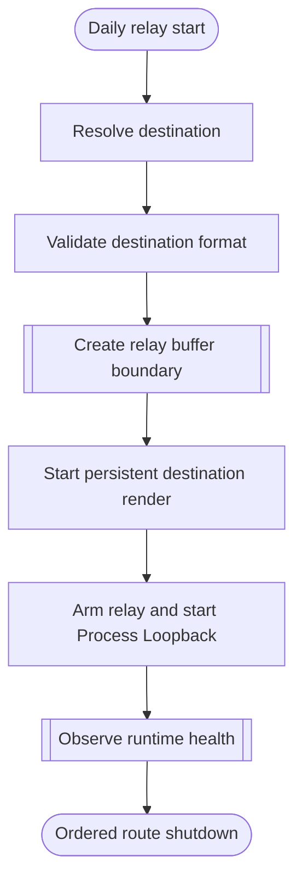

<!--vf:node
schema "vf-kb/0.1"
id "leaudio-router.v0-1.relay-session"
kind "behavior"
parent "leaudio-router.v0-1"
coverage "mapped"
-->

<!--vf:summary
entry "ProcessLoopbackRelay.Run begins after the normal executable path acquires the single-instance guard."
problem "System audio must reach Buds without allowing the final destination AudioClient to repeatedly tear down during ordinary silence."
behavior "Resolve and validate the destination, construct one capture-to-ring-to-render route, start destination rendering first, arm capture, and observe route health until shutdown."
exit "Shutdown returns the provider to keepalive, stops capture, stops render, prints final counters, and exits the route process."
-->

<!--vf:source
id "runtime"
repo "STanJK/le-audio-windows-relay"
rev "57d56afbc75453d2018fa379972bf2cab071fa27"
path "Runtime/ProcessLoopbackRelay.cs"
symbol "ProcessLoopbackRelay"
-->

<!--vf:source
id "capture"
repo "STanJK/le-audio-windows-relay"
rev "57d56afbc75453d2018fa379972bf2cab071fa27"
path "Audio/ProcessLoopbackCapture.cs"
symbol "ProcessLoopbackCapture"
-->

<!--vf:source
id "format"
repo "STanJK/le-audio-windows-relay"
rev "57d56afbc75453d2018fa379972bf2cab071fa27"
path "Core/AudioFormatGuard.cs"
symbol "AudioFormatGuard"
-->

<!--vf:claim
id "capture-excludes-relay-process-tree"
type "fact"
text "The daily capture is created in ExcludeTargetProcessTree mode for the current relay process."
evidence "runtime"
evidence "capture"
-->

<!--vf:claim
id "destination-starts-before-capture"
type "fact"
text "The destination player is started before the provider is armed and before Process Loopback capture starts."
evidence "runtime"
-->

<!--vf:claim
id "route-is-single-generation"
type "fact"
text "ProcessLoopbackRelay.Run constructs one destination, one player, and one capture instance and contains no route rebuild loop."
evidence "runtime"
-->

**Why:** The daily route keeps one final Buds render stream alive so ordinary silence does not require V0.1 to tear down and recreate the destination path. [explain →](./v0.1.fact.md#relay-session-why)

**What:** One relay invocation builds a destination-first Process Loopback route, then leaves the same capture and render generation running while health is observed. [explain →](./v0.1.fact.md#relay-session-what)

**Outcome:** The route remains active until Ctrl+C or a fatal outer error, then shuts its capture and render objects down in a fixed order. [explain →](./v0.1.fact.md#relay-session-outcome)



<!--vf:pseudocode
node leaudio-router.v0-1.relay-session
flow daily-route
audience human
purpose "Linear reading companion to the Mermaid flow; ignored by AI context by default."
-->
```text
START one relay invocation:
    resolve exactly one active Buds destination
    require a 48 kHz Float32 stereo destination mix format
    reject Buds or CABLE Input as the Windows default render sink

    create one SPSC ring and one ring-backed render provider
    create one shared/event-driven destination player
    create Process Loopback capture excluding this process tree

    start destination rendering first
    wait for the activation transient
    arm relay
    start capture

    observe runtime health until Ctrl+C

    return provider to keepalive
    stop capture
    stop destination render
    print final counters
```
<!--vf:end-->
