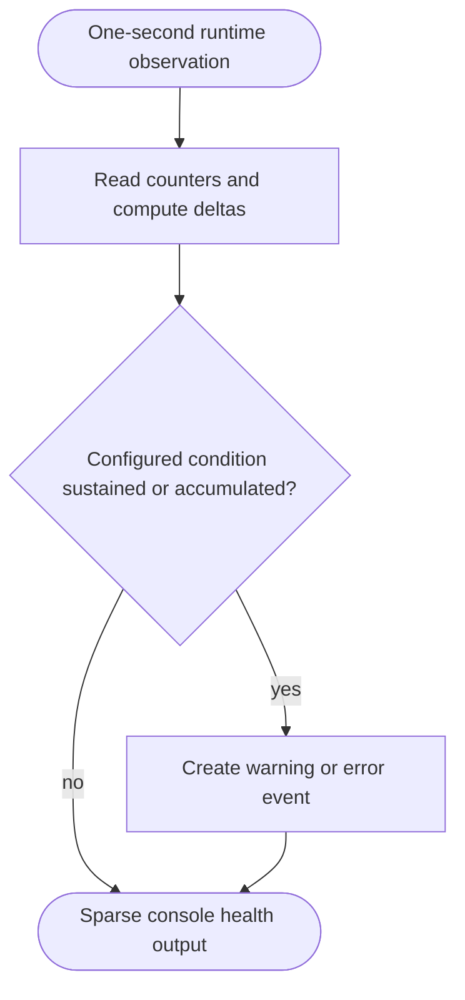

<!--vf:node
schema "vf-kb/0.1"
id "leaudio-router.v0-1.runtime-health"
kind "behavior"
parent "leaudio-router.v0-1.relay-session"
coverage "mapped"
-->

<!--vf:summary
entry "After the activation transient, ProcessLoopbackRelay samples capture, render, ring, and callback counters once per second."
problem "The daily route needs low-noise visibility into material underrun, overflow, empty-ring, callback-error, high-fill, and slow-render conditions."
behavior "Compute counter deltas and short streaks, suppress small transients, and emit warning or error events only after configured thresholds are crossed."
exit "ProcessLoopbackRelay prints emitted health events while leaving route state and recovery behavior unchanged."
-->

<!--vf:source
id "health"
repo "STanJK/le-audio-windows-relay"
rev "57d56afbc75453d2018fa379972bf2cab071fa27"
path "Runtime/RuntimeHealthFilter.cs"
symbol "RuntimeHealthFilter"
-->

<!--vf:source
id "runtime"
repo "STanJK/le-audio-windows-relay"
rev "57d56afbc75453d2018fa379972bf2cab071fa27"
path "Runtime/ProcessLoopbackRelay.cs"
symbol "ProcessLoopbackRelay"
-->

<!--vf:source
id "counters"
repo "STanJK/le-audio-windows-relay"
rev "57d56afbc75453d2018fa379972bf2cab071fa27"
path "Runtime/RelayRuntimeCounters.cs"
symbol "RelayRuntimeCounters"
-->

<!--vf:claim
id "health-is-polled-once-per-second"
type "fact"
text "The daily runtime waits in one-second intervals and calls RuntimeHealthFilter.Observe after the initial two-second activation transient."
evidence "runtime"
-->

<!--vf:claim
id "health-filter-is-observer-only"
type "fact"
text "RuntimeHealthFilter.Observe returns HealthEvent values and does not mutate the route, rebuild audio clients, or reset the ring."
evidence "health"
evidence "runtime"
-->

**Why:** Long daily runs need material failures surfaced without restoring noisy one-hertz status spam during normal operation. [explain →](./v0.1.fact.md#runtime-health-why)

**What:** The filter converts raw counter deltas and sustained streaks into sparse warning/error events for selected runtime conditions. [explain →](./v0.1.fact.md#runtime-health-what)

**Outcome:** Operators receive filtered diagnostics, but V0.1 does not automatically recover a stale route or rebuild an invalidated endpoint. [explain →](./v0.1.fact.md#runtime-health-outcome)



<!--vf:pseudocode
node leaudio-router.v0-1.runtime-health
flow health-observation
audience human
purpose "Linear reading companion to the Mermaid flow; ignored by AI context by default."
-->
```text
EVERY one second after startup settling:
    read capture, render, underrun, overflow, and callback counters
    compute deltas from the previous observation

    accumulate small underrun/overflow deltas until they become material
    track sustained high fill, empty-while-active, and slow-render streaks

    emit WARN or ERROR only when a configured threshold is crossed
    print emitted events

    do not alter route state
    do not restart audio clients
    do not reset the ring
```
<!--vf:end-->
