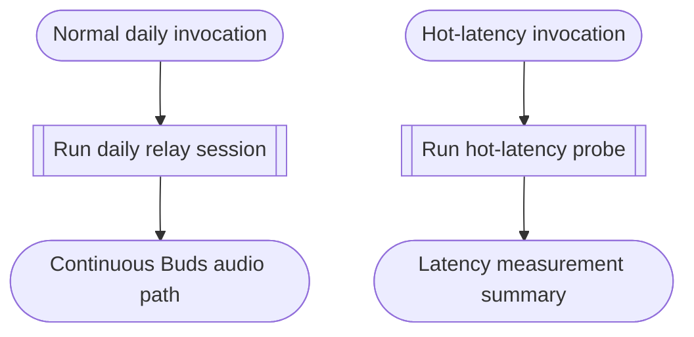

<!--vf:node
schema "vf-kb/0.1"
id "leaudio-router.v0-1"
kind "module"
coverage "mapped"
-->

<!--vf:summary
entry "A normal daily invocation or an explicit hot-latency diagnostic invocation enters the V0.1 executable."
problem "Windows LE Audio needed a persistent destination render path and an inspectable user-mode relay for stability and latency experiments."
behavior "Run a Process Loopback relay for daily audio or run a bounded hot-latency measurement using the same relay primitives."
exit "Daily audio reaches the persistent Buds render path until process shutdown, or the diagnostic path returns a latency summary."
-->

<!--vf:source
id "program"
repo "STanJK/le-audio-windows-relay"
rev "57d56afbc75453d2018fa379972bf2cab071fa27"
path "Program.cs"
symbol "Program"
-->

<!--vf:source
id "daily-runtime"
repo "STanJK/le-audio-windows-relay"
rev "57d56afbc75453d2018fa379972bf2cab071fa27"
path "Runtime/ProcessLoopbackRelay.cs"
symbol "ProcessLoopbackRelay"
-->

<!--vf:source
id "hot-probe"
repo "STanJK/le-audio-windows-relay"
rev "57d56afbc75453d2018fa379972bf2cab071fa27"
path "Diagnostics/ProcessLoopbackLatencyProbe.cs"
symbol "ProcessLoopbackLatencyProbe"
-->

<!--vf:claim
id "normal-invocation-runs-daily-relay"
type "fact"
text "After diagnostic modes and single-instance acquisition are handled, the normal executable path calls ProcessLoopbackRelay.Run."
evidence "program"
-->

<!--vf:claim
id "hot-latency-is-separate-mode"
type "fact"
text "An explicit --hot-latency invocation routes to ProcessLoopbackLatencyProbe.Run instead of the daily relay."
evidence "program"
-->

**Why:** V0.1 exists to keep the final LE Audio destination hot while relaying ordinary Windows application audio and preserving a reproducible latency laboratory. [explain →](./v0.1.fact.md#root-why)

**What:** The executable exposes a daily Process Loopback relay plus an explicit hot-latency diagnostic path built around the same audio primitives. [explain →](./v0.1.fact.md#root-what)

**Outcome:** A normal invocation continuously routes captured system audio to Buds until shutdown, while a diagnostic invocation produces bounded timing measurements. [explain →](./v0.1.fact.md#root-outcome)



<!--vf:pseudocode
node leaudio-router.v0-1
flow v0-1-surface
audience human
purpose "Linear reading companion to the Mermaid flow; ignored by AI context by default."
-->
```text
ON normal daily invocation:
    acquire the single-instance guard
    run one Process Loopback relay session
    keep the destination path alive until shutdown or fatal failure

ON --hot-latency:
    run the bounded hot-latency laboratory
    return the measured timing summary
```
<!--vf:end-->
