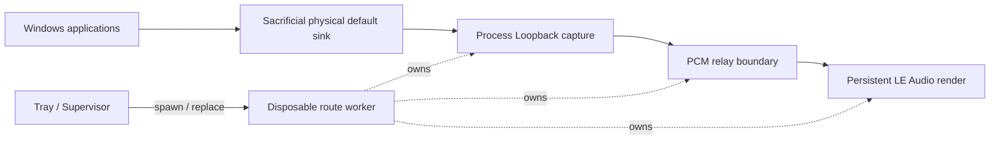

# LE Audio Router

**A Windows tray relay for keeping Bluetooth LE Audio playback alive, recoverable, and observable.**

[](https://www.microsoft.com/windows/windows-11)
[](https://dotnet.microsoft.com/)


[Getting started](docs/GETTING_STARTED.md) · [Why this exists](docs/WHY_THIS_EXISTS.md) · [How it works](docs/HOW_IT_WORKS.md) · [Validation](docs/VALIDATION.md) · [Troubleshooting](docs/TROUBLESHOOTING.md) · [Architecture](docs/ARCHITECTURE.md) · [中文](README.zh-CN.md)

> [!IMPORTANT]
> **Current status: V0.21 Daily Test Candidate 1.**
>
> The current architecture is usable enough for sustained daily testing, but full multi-day validation is still in progress. It is **not yet a stable release**, and there are currently **no prebuilt binaries or installer**.

LE Audio Router is a user-mode Windows audio relay built for a specific class of Bluetooth LE Audio stability problems observed during real daily use.

Instead of making the LE Audio earbuds the Windows default output directly, normal applications render to a separate physical output endpoint. LE Audio Router captures that system mix with **Process Loopback**, forwards it to the LE Audio endpoint, and keeps the destination render stream continuously alive — including during silence, when it renders real zero PCM.

The current validated target is **Samsung Galaxy Buds3 Pro** on Windows 11. Other LE Audio devices may work, but they are not yet claimed as supported.

---

## Why this exists

Windows 11 has native Bluetooth LE Audio support, but support depends on the complete PC hardware and driver stack. Microsoft explicitly notes that not every Windows 11 PC with Bluetooth LE supports LE Audio; compatible radio/audio hardware and manufacturer-provided LE Audio drivers are required.

Microsoft's current user-facing check is:

**Settings → Bluetooth & devices → Devices → Use LE Audio when available**

If that option is missing, Windows does not currently consider the PC LE Audio capable.

On our test systems, we observed a separate runtime problem: after silence or stream teardown/reconstruction, the LE Audio destination could sometimes return in an abnormal stereo state — subjectively much wider, strongly separated, and hollow on mono material. Reconnecting the device or rebuilding the route could restore normal playback.

The first successful workaround was simple:

> **Do not let the final LE Audio render stream go away.**

Keeping one render stream alive and feeding **real zero PCM during silence** prevented the persistent failure from reproducing in our daily path. LE Audio Router turns that workaround into a supervised tray application with reconnect, sleep/resume recovery, logging, and a replaceable audio-route generation.

Read the full background: **[Why this exists](docs/WHY_THIS_EXISTS.md)**.

---

## What it does

- **Keeps the LE Audio destination hot**  
  The final shared-mode render stream stays open continuously and receives zero PCM during silence.

- **Uses Windows Process Loopback**  
  Captures ordinary Windows render streams while excluding the router worker process tree, so the relay does not recursively capture itself.

- **Recovers from endpoint disconnect/reconnect**  
  Core Audio notifications wake the supervisor; fresh endpoint enumeration decides what is actually available.

- **Treats sleep/resume as a route-generation boundary**  
  Any route created before Windows suspend is considered stale after resume and is rebuilt.

- **Runs the audio route in a disposable worker process**  
  One worker PID owns one complete audio generation, including capture, buffering, render, and route-local state.

- **Supports multiple Windows audio stream categories**  
  GameEffects, GameMedia, Media, and Default/unset are available from the tray. GameEffects is the current daily default.

- **Keeps a low-volume lifecycle journal**  
  Logs app, endpoint, power, worker-generation, mode, and restart transitions without heartbeat/ring-warning spam.

- **Includes a temporary positive-drift guard**  
  Keeps the retained PCM queue near the 10 ms target cushion during long runs. This is operational mitigation, not finished clock synchronization.

---

## How it works



The important detail is that the **LE Audio endpoint is not the normal Windows default output**.

Applications render to a sacrificial physical endpoint such as an active NVIDIA HDMI or Realtek output. The worker captures that render mix using Process Loopback in **ExcludeTargetProcessTree** mode, then continuously renders the captured PCM to the LE Audio destination.

This creates two useful properties:

1. the router can keep the LE Audio endpoint open independently of application silence;
2. the router can destroy and recreate the entire destination generation without restarting every application using audio.

More detail: **[How it works](docs/HOW_IT_WORKS.md)**.

---

## Quick start

### Requirements

| Requirement | Current expectation |
|---|---|
| OS | Windows 11 x64 |
| LE Audio | PC and earbuds must both support Bluetooth LE Audio |
| Windows LE Audio setting | **Use LE Audio when available** should be present and enabled |
| .NET | .NET 10 SDK for source builds |
| Destination | Currently validated with **Galaxy Buds3 Pro** |
| Default Windows output | A separate physical render endpoint, **not** the Buds and not VB-CABLE |
| Spatial Sound | Recommended off for the current validation baseline |

> [!NOTE]
> Windows LE Audio support is hardware/driver dependent. Bluetooth LE capability alone does not imply LE Audio capability.

### Build

```powershell
git clone https://github.com/STanJK/le-audio-windows-relay.git
cd le-audio-windows-relay

dotnet build .\LEAudioRouter.csproj
```

Run:

```powershell
.\bin\Debug\net10.0-windows\LEAudioRouter.exe
```

The application runs from the Windows system tray.

### Before starting the route

1. Pair and connect the LE Audio earbuds.
2. Make sure Windows is actually using the LE Audio endpoint.
3. Set the Windows default output to a **separate physical sink** such as active HDMI or Realtek.
4. Start LE Audio Router.
5. Play audio normally.

The tray should reach:

```text
Running | Backend gen: N | Mode: GameEffects
```

Full setup instructions: **[Getting started](docs/GETTING_STARTED.md)**.

---

## Tray controls

| Control | Meaning |
|---|---|
| **Mode → GameEffects** | Current default; empirically preferred in this project |
| **Mode → GameMedia** | Windows GameMedia render category |
| **Mode → Media** | Windows Media render category |
| **Mode → Default / unset** | Do not explicitly set a category |
| **Restart audio route** | Destroy and recreate the current worker generation |
| **Exit** | Stop routing and exit the tray application |

There is intentionally no separate **Router enabled** or **Auto reconnect** switch.

The product model is:

```text
application alive
    = routing intent
```

---

## Lifecycle behavior

### Earbuds disconnected

```text
Running
→ endpoint disappears
→ worker stops
→ WaitingForEndpoint
→ zero background reconnect workers
```

### Earbuds reconnect

```text
Core Audio topology change
→ re-enumerate endpoint reality
→ endpoint available
→ start one fresh worker generation
→ Running
```

### Windows sleep/resume

```text
Suspend
→ record suspended power state

Resume
→ PowerRevision + 1
→ old worker generation becomes stale
→ re-probe endpoints
→ create a fresh generation if eligible
```

---

## Timing and buffering

The relay currently uses:

| Parameter | Current value |
|---|---:|
| Format | 48 kHz / Float32 / stereo |
| Capture buffer | 10 ms |
| Target retained cushion | 10 ms |
| Startup hold limit | 40 ms |
| Physical ring capacity | 80 ms |

The **80 ms ring is safety storage, not the normal latency target**.

The current provisional drift guard regulates **post-render residual fill** around the 10 ms target:

```text
target residual       10 ms
gradual trim stops    11 ms
gradual trim starts   12 ms
hard recenter         20 ms
physical capacity     80 ms
```

This is intentionally temporary. A proper clock-control design remains future work.

---

## Validation status

| Area | Status |
|---|---|
| Real Process Loopback → Buds route | ✅ Validated |
| Persistent zero keepalive | ✅ Validated in daily use |
| Endpoint disconnect → zero worker churn | ✅ Validated |
| Endpoint reconnect → fresh generation | ✅ Validated |
| Mode switch → one generation replacement | ✅ Validated |
| Invalid default output → TopologyBlocked | ✅ Validated |
| Windows suspend/resume | 🧪 Daily validation in progress |
| Multi-hour / multi-day stability | 🧪 Daily validation in progress |
| Provisional drift guard audibility | 🧪 Daily validation in progress |
| Galaxy Buds3 Pro | ✅ Current primary target |
| Other LE Audio earbuds/headsets | ⚪ Not yet claimed |
| Microphone forwarding | ❌ Out of scope |
| Full clock synchronization | ❌ Not implemented yet |

See **[Validation](docs/VALIDATION.md)** for exactly what has and has not been established.

---

## Lifecycle logs

Low-volume lifecycle logs are written to:

```text
%LOCALAPPDATA%\LEAudioRouter\logs\lifecycle-YYYY-MM-DD.log
```

Examples of persisted events:

```text
APP_START
POWER_SUSPEND
POWER_RESUME
ENDPOINT_AVAILABLE
ENDPOINT_ABSENT
TOPOLOGY_BLOCKED
WORKER_RUNNING
WORKER_REPLACE
WORKER_EXIT
MODE_CHANGE
MANUAL_RESTART
```

The persistent log intentionally does **not** contain heartbeat spam, ring occupancy warnings, overflow warnings, or per-second timing telemetry.

---

## What this project is not

LE Audio Router is **not**:

- a Bluetooth driver;
- a replacement LE Audio host stack;
- an LC3 codec implementation;
- a firmware patch for earbuds;
- a microphone forwarding solution;
- a generic promise to fix every Windows Bluetooth problem;
- a completed low-latency or clock-synchronization framework.

It is a focused user-mode routing and lifecycle experiment built around one concrete Windows LE Audio failure mode.

---

## Windows LE Audio context

Useful Microsoft references:

- [Check whether a Windows 11 device supports Bluetooth LE Audio](https://support.microsoft.com/en-us/windows/hardware/bluetooth/check-if-a-windows-11-device-supports-bluetooth-low-energy-audio)
- [Bluetooth Low Energy (LE) Audio architecture for Windows drivers](https://learn.microsoft.com/en-us/windows-hardware/drivers/bluetooth/bluetooth-low-energy-audio)
- [Application loopback audio capture sample](https://learn.microsoft.com/en-us/samples/microsoft/windows-classic-samples/applicationloopbackaudio-sample/)
- [PROCESS_LOOPBACK_MODE](https://learn.microsoft.com/en-us/windows/win32/api/audioclientactivationparams/ne-audioclientactivationparams-process_loopback_mode)
- [Windows audio stream categories](https://learn.microsoft.com/en-us/windows/win32/api/audiosessiontypes/ne-audiosessiontypes-audio_stream_category)

The project tries to keep two things separate:

- **Microsoft-documented platform behavior**
- **observations from this project's own test systems**

That distinction is important when reporting LE Audio issues publicly.

---

## Documentation

| Document | Purpose |
|---|---|
| [Getting started](docs/GETTING_STARTED.md) | Requirements, build, first run, daily operation |
| [Why this exists](docs/WHY_THIS_EXISTS.md) | Windows LE Audio background and observed failure mode |
| [How it works](docs/HOW_IT_WORKS.md) | Process Loopback, persistent render, lifecycle, timing |
| [Validation](docs/VALIDATION.md) | What is proven, in progress, or unverified |
| [Troubleshooting](docs/TROUBLESHOOTING.md) | Common startup and lifecycle problems |
| [Architecture](docs/ARCHITECTURE.md) | Current internal ownership and process model |
| [Project history](docs/PROJECT_HISTORY.md) | V0.1 → Round4 → V0.20.x → V0.21 candidate |
| [Community / Microsoft publishing](docs/COMMUNITY_AND_MICROSOFT.md) | How to turn the evidence into articles and platform reports |
| [Public release checklist](docs/PUBLIC_RELEASE_CHECKLIST.md) | What remains before formal V0.21 |
| [Architecture decisions](docs/decisions/) | ADRs for worker isolation, endpoint lifecycle, power, timing |

---

## Contributing

Bug reports and test results are especially useful if they include:

- Windows build;
- Bluetooth controller and driver version;
- headset/earbuds model and firmware if known;
- whether **Use LE Audio when available** is present;
- exact reproduction steps;
- whether reconnect or worker restart clears the problem;
- the relevant lifecycle log excerpt.

See **[CONTRIBUTING.md](CONTRIBUTING.md)**.

---

## Project status and release policy

The current daily candidate is intentionally frozen while long-run validation proceeds.

If a runtime defect is found:

```text
frozen daily candidate
    stays unchanged

round4 development branch
    receives the fix

new candidate
    is frozen if another full validation round is needed
```

Formal **V0.21** is reserved for a baseline that completes the current daily-use validation round.

---

## License

An open-source license has **not yet been selected for the public release**.

Until a license file is added, normal copyright rules apply even if the repository is publicly visible. Selecting and adding the project license is part of the public-release checklist.
