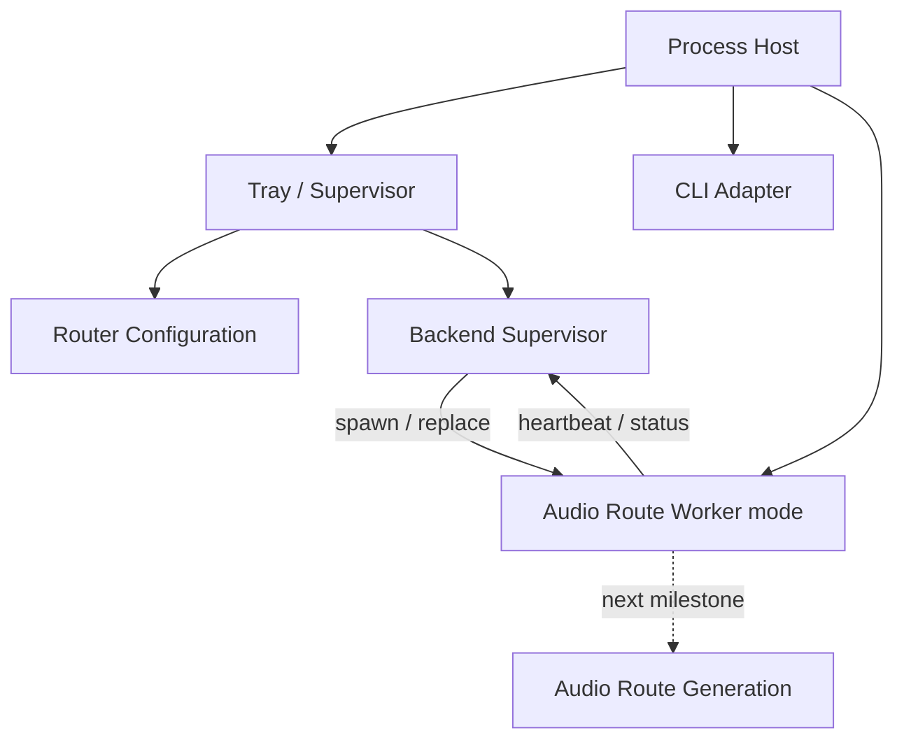

# LE Audio Router

**Current frozen milestone: V0.20 — first stabilized Tray form**

Round4 is a clean architectural rewrite of the Windows LE Audio relay.

The previous known-good Process Loopback implementation is frozen under [Legacy/V0.1](Legacy/V0.1/README.md). New production code must not depend on the legacy archive.

## V0.20 milestone

V0.20 is the first stabilized Tray-shaped application baseline. It freezes the product/lifecycle shell before real audio routing is reintroduced.

It establishes:

- one long-lived Windows tray/supervisor process;
- one disposable backend worker process per route generation;
- local named-pipe handshake and heartbeat monitoring;
- automatic worker replacement after failure;
- manual route replacement through **Restart audio route**;
- render-category selection: GameEffects, GameMedia, Media, and Default/unset;
- GameEffects as the default;
- the two-process fault/diagnostic boundary documented by ADR 0001;
- a current Round4 VF-KB model for the tray/worker architecture;
- no dependency on NAudio or the Legacy V0.1 implementation yet.

Development after the frozen V0.20 milestone now reconnects real audio routing inside the disposable worker generation. The new Routing/Timing/Telemetry implementation is handwritten and does not import Legacy V0.1.

## Product semantics

```text
application alive
    = routing intent

worker failure
    = automatic recovery

user wants routing stopped
    = exit application
```

There is intentionally no separate Router Enabled toggle and no configurable Auto reconnect policy.

See [docs/ARCHITECTURE.md](docs/ARCHITECTURE.md), [ADR 0001](docs/decisions/0001-out-of-process-route-generation.md), the [V0.20 release note](docs/releases/V0.20.md), and the current [Round4 VF-KB](VF/round4-shell.vf.md).

## Runtime architecture



### Hard invariants

1. **Application lifetime is owned by the tray/supervisor process.**
2. **Application alive implies routing intent.**
3. **Recovery is automatic and not user-configurable.**
4. **One worker PID represents one disposable Audio Route generation.**
5. **The process boundary is a user-mode fault/diagnostic boundary, not an audio-domain boundary.**
6. **Exactly two runtime process roles are allowed unless a later ADR changes this.**
7. **Legacy V0.1 is evidence, not a library.**
8. **Clock synchronization remains a future Timing module.**

## Version metadata

V0.20 is embedded into the .NET application metadata:

```text
Version              0.20.0
AssemblyVersion      0.20.0.0
FileVersion          0.20.0.0
InformationalVersion V0.20
```

## Build

```powershell
dotnet build .\LEAudioRouter.csproj
```

Running the executable without arguments starts the tray shell.
