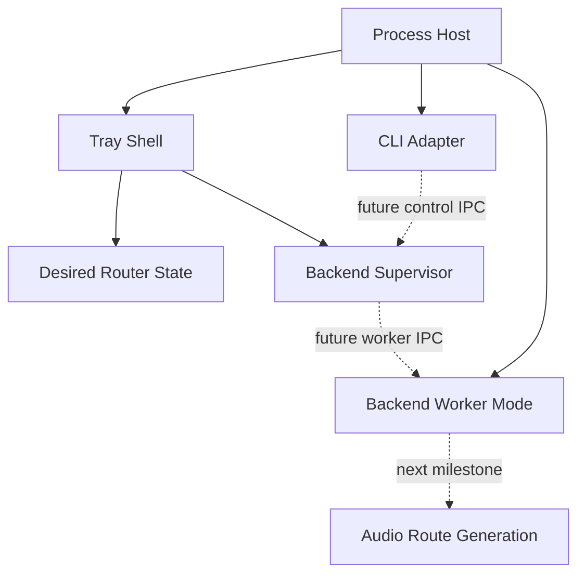

# LE Audio Router

Round4 is a clean architectural rewrite of the Windows LE Audio relay.

The previous known-good Process Loopback implementation is frozen under [Legacy/V0.1](Legacy/V0.1/README.md). New production code must not depend on the legacy archive.

## Current milestone

The current root implementation is only the **Shell bootstrap**.

It establishes:

- one long-lived Windows tray application;
- right-click desired-state controls for GameEffects, GameMedia, Media, and Default/unset;
- GameEffects as the new desired default mode;
- a frontend-neutral supervisor that spawns and replaces disposable backend generations;
- a local named-pipe worker protocol with handshake and heartbeat monitoring;
- explicit reserved process modes for future backend workers and CLI control;
- no dependency on NAudio or the legacy relay implementation.

The backend worker currently exercises lifecycle/IPC only; it deliberately contains no audio code yet.

## Architectural direction



### Hard invariants

1. **Shell lifetime is independent of backend lifetime.**
2. **One future backend worker will represent one replaceable audio route generation.**
3. **Supervisor owns recovery/restart policy; backend owns route-local audio behavior.**
4. **Legacy V0.1 is evidence, not a library. New code does not import it.**
5. **Clock synchronization remains a future Timing module and is not part of the Shell bootstrap.**

## Build

```powershell
dotnet build .\LEAudioRouter.csproj
```

Running the executable without arguments starts the tray shell.
