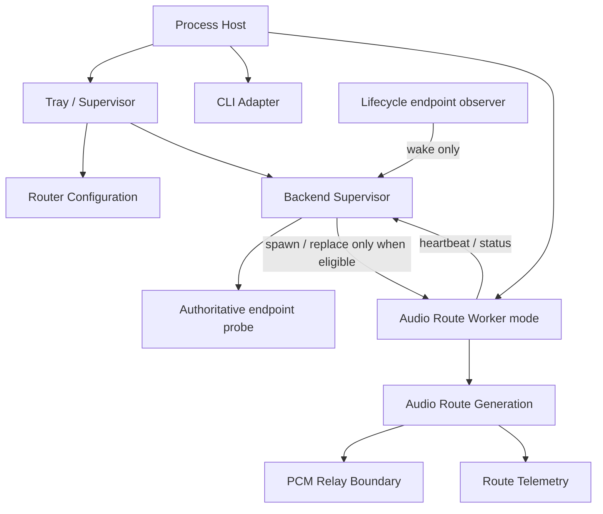

# LE Audio Router

**Current candidate: V0.21 Daily Test Candidate 1 — full daily-use validation in progress**

Round4 is a clean architectural rewrite of the Windows LE Audio relay.

The previous known-good Process Loopback implementation is frozen under [Legacy/V0.1](Legacy/V0.1/README.md). New production code must not depend on the legacy archive.

## V0.21 Daily Test Candidate 1

This branch is a **frozen daily-use candidate**, not yet a stable/public release.

Its runtime code is pinned to development baseline:

`326fa42cf2a6069c97ab11c9a60e635b4481c1c0`

The candidate is currently undergoing full daily-use validation, including repeated endpoint reconnect, Windows suspend/resume, long-running audio, and observation of the provisional positive-drift guard.

A failure found during this validation should produce a new candidate or development fix rather than rewriting this frozen baseline.

### Candidate scope

- real Process Loopback → Buds route;
- disposable worker generation;
- event-driven endpoint disconnect/reconnect;
- Windows suspend/resume via PowerRevision invalidation;
- lifecycle-only persistent journal;
- provisional positive-drift guard centered on a 10 ms residual cushion;
- GameEffects as the daily default.

### Validation status

Already established before this candidate:
- real route startup and audio output;
- endpoint disconnect enters WaitingForEndpoint with zero worker churn;
- endpoint reconnect creates one fresh generation;
- topology blocking/recovery;
- mode changes replace one generation.

**Still under full daily testing in this candidate:**
- repeated sleep/resume over normal daily use;
- multi-hour and multi-day route stability;
- subjective artifact check for gradual/hard drift correction;
- lifecycle log quality and absence of spam;
- interaction between power cycles, reconnects, mode changes, and worker replacement.

Do not describe this candidate as stable until that validation is complete.

## Historical V0.20 milestone

V0.20 is the first stabilized Tray-shaped application baseline. It freezes the product/lifecycle shell before real audio routing is reintroduced.

It establishes:

- one long-lived Windows tray/supervisor process;
- one disposable backend worker process per route generation;
- local named-pipe handshake and heartbeat monitoring;
- automatic worker replacement after failure;
- manual route replacement through **Restart audio route**;
- render-category selection: GameEffects, GameMedia, Media, and Default/unset;
- GameEffects as the default;
- the two-process fault/diagnostic boundary documented by ADR 0001;
- a current Round4 VF-KB model for the tray/worker architecture;
- no dependency on NAudio or the Legacy V0.1 implementation.

Development after the frozen V0.20 milestone now contains the handwritten real audio route, event-driven endpoint lifecycle reconciliation, WM_POWERBROADCAST suspend/resume invalidation, a low-volume persistent lifecycle journal, and a provisional one-sided positive-drift guard for daily-use testing. None of the new production path imports Legacy V0.1.

## Product semantics

```text
application alive
    = routing intent

target endpoint absent
    = wait quietly; do not spawn workers

target endpoint becomes active
    = start a fresh route generation

worker/route failure while endpoint is active
    = automatic bounded recovery

user wants routing stopped
    = exit application
```

There is intentionally no separate Router Enabled toggle and no configurable Auto reconnect policy.

See [docs/ARCHITECTURE.md](docs/ARCHITECTURE.md), [ADR 0001](docs/decisions/0001-out-of-process-route-generation.md), [ADR 0002](docs/decisions/0002-event-driven-endpoint-reconciliation.md), the [V0.20 release note](docs/releases/V0.20.md), and the current [Round4 VF-KB](VF/round4-shell.vf.md).

## Runtime architecture



### Hard invariants

1. **Application lifetime is owned by the tray/supervisor process.**
2. **Application alive implies routing intent.**
3. **Recovery is automatic and not user-configurable.**
4. **Endpoint notifications are wake-up signals; re-enumeration is the source of truth.**
5. **An absent target endpoint implies zero worker processes and zero reconnect spawn attempts.**
6. **One worker PID represents one disposable Audio Route generation.**
7. **The process boundary is a user-mode fault/diagnostic boundary, not an audio-domain boundary.**
8. **Exactly two runtime process roles are allowed unless a later ADR changes this.**
9. **Legacy V0.1 is evidence, not a library.**
10. **Clock synchronization remains a future Timing module.**

## Version metadata

This frozen daily-test branch embeds:

```text
Version              0.21.0-daily.1
AssemblyVersion      0.21.0.0
FileVersion          0.21.0.0
InformationalVersion V0.21 Daily Test Candidate 1
```

This is intentionally a prerelease identity. Formal V0.21 is reserved for the candidate that completes full daily-use validation.

## Build

```powershell
dotnet build .\LEAudioRouter.csproj
```

Running the executable without arguments starts the tray shell.


## Active daily-use validation additions

The current development branch extends the V0.20.2 endpoint-lifecycle baseline with:

- direct `WM_POWERBROADCAST` suspend/resume observation;
- a monotonically increasing PowerRevision;
- mandatory replacement of any route generation that predates a resume;
- lifecycle-only persistent logging under `%LOCALAPPDATA%\LEAudioRouter\logs\`;
- a provisional positive-drift guard that prevents slow ring growth from pinning the SPSC ring at capacity.

The persistent log intentionally excludes heartbeat, ring-fill warnings, overflow warnings, and other high-frequency telemetry.
