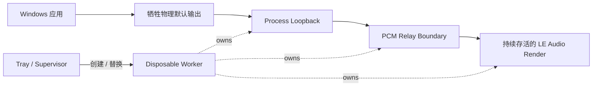

# LE Audio Relay

**一个用于让 Windows 蓝牙 LE Audio 播放链路持续存活、可恢复、可观测的系统托盘音频中继工具。**

[](https://www.microsoft.com/windows/windows-11)
[](https://dotnet.microsoft.com/)


[English](README.md) · [快速开始](docs/GETTING_STARTED.md) · [为什么做这个](docs/WHY_THIS_EXISTS.md) · [工作原理](docs/HOW_IT_WORKS.md) · [验证状态](docs/VALIDATION.md) · [故障排查](docs/TROUBLESHOOTING.md)

> [!IMPORTANT]
> **当前状态：V0.21 Daily Test Candidate 1。**
>
> 目前架构已经可以进入长期日用测试，但完整的多日验证仍在进行中。它**还不是稳定正式版**，目前也**没有预编译安装包**。

> [!NOTE]
> **开发说明 — VibeFactory 集成**
>
> LE Audio Relay 的实际开发过程中已经嵌入使用了 **VibeFactory**。VibeFactory 是一个独立的开发系统/库，目前仍处于 **Private** 状态，并计划在自身达到公开节点后单独发布。
>
> **运行或编译 LE Audio Relay 不需要访问 VibeFactory**。这里暂时只做高层说明，是因为 VibeFactory 还没有到自己的公开文档节点，而不是因为这项集成本身被当作需要严格保密的内容。

LE Audio Relay 是一个 Windows 用户态音频中继工具，最初用于解决我们在实际 Windows LE Audio 日用过程中观察到的一类生命周期问题。

它不会直接让普通应用把 Galaxy Buds3 Pro 当作 Windows 默认输出。相反，应用先向另一个稳定的物理输出端点渲染，LE Audio Relay 通过 **Process Loopback** 捕获系统混音，再把 PCM 持续送到 LE Audio 耳机，并且在静音期间仍然向最终目的端输出真实的 zero PCM，从而让最终 LE Audio render stream 保持存活。

目前主要验证目标是 **Samsung Galaxy Buds3 Pro + Windows 11**。其他 LE Audio 耳机可能可以工作，但现在还不声明为正式支持。

---

## 为什么需要这个工具

Windows 11 原生支持 Bluetooth LE Audio，但是否真正可用取决于完整的平台栈，而不是“蓝牙版本够新”这么简单。

微软目前公开说明，Windows LE Audio 需要：

- Windows 11 22H2 或更高版本；
- 兼容的 Bluetooth LE 硬件与音频能力；
- PC 厂商提供的 LE Audio 蓝牙和音频驱动。

用户侧最直接的检查方式是：

**设置 → 蓝牙和设备 → 设备 → 可用时使用 LE Audio**

如果这个选项不存在，Windows 当前并不认为这台 PC 具备完整 LE Audio 支持。

微软参考：

- https://support.microsoft.com/en-us/windows/hardware/bluetooth/check-if-a-windows-11-device-supports-bluetooth-low-energy-audio
- https://learn.microsoft.com/en-us/windows-hardware/drivers/bluetooth/bluetooth-low-energy-audio

### 我们自己观察到的问题

下面这些是**项目实测观察**，不是微软官方结论，也不代表所有 Windows LE Audio 设备都会如此。

在早期 LinkBuds S 和后来的 Galaxy Buds3 Pro 测试中，我们观察到过：

- 静音后重新开始播放时出现明显起播延迟或前段被截断；
- LE Audio 最终 render path 会在静音后被 teardown；
- route 重建后，Buds3 Pro 有概率进入异常 stereo image；
- 声场会明显变宽、左右分离异常，mono 内容听起来发空；
- reconnect 或重建 route 后可以恢复；
- 某些异常会短时间自恢复，另一些会持续到 reconnect。

目前**没有证明根因到底在 Windows、驱动、控制器还是耳机**。

但有一个非常清晰的操作性结果：

> **不要让最终 LE Audio render stream 因为静音而消失。**

当我们持续保持一个目的端 render stream，并在没有实际音频时持续写入真实 zero PCM 后，之前那个持续性异常声场在日常路径中不再复现。

这就是本项目最核心的 invariant。

详细背景：[为什么做这个](docs/WHY_THIS_EXISTS.md)

---

## 它现在能做什么

- **持续保持 LE Audio 目的端 render stream**
- **使用 Windows Process Loopback 捕获普通应用音频**
- **排除自己的 worker process tree，避免递归捕获**
- **耳机断联后安静等待，不后台疯狂重试**
- **耳机重新出现后自动创建一个新 route generation**
- **Windows sleep/resume 后强制废弃旧 generation**
- **通过独立 worker PID 隔离一整代 route 状态**
- **支持 GameEffects / GameMedia / Media / Default**
- **记录低频 Lifecycle 日志**
- **暂时缓解长期运行中的正向时钟漂移**

---

## 整体音频路径



这里一个非常反直觉但重要的点是：

> **Buds 不是 Windows 默认输出。**

Windows 普通应用先向一个稳定的物理端点渲染，例如 NVIDIA HDMI 或 Realtek。Relay 再用 Process Loopback 把它抓出来，并把最终 LE Audio endpoint 的生命周期掌握在自己手里。

---

## 快速开始

### 当前要求

| 项目 | 当前要求 |
|---|---|
| 系统 | Windows 11 x64 |
| LE Audio | PC 和耳机都必须支持 |
| Windows 设置 | 应该能看到 **可用时使用 LE Audio** |
| .NET | 从源码构建需要 .NET 10 SDK |
| 当前主要验证耳机 | Galaxy Buds3 Pro |
| Windows 默认输出 | 必须是另一个物理端点 |
| Spatial Sound | 当前基线建议关闭 |

### 编译

```powershell
git clone https://github.com/STanJK/LE-Audio-Relay.git
cd LE-Audio-Relay

dotnet build .\LEAudioRelay.csproj -c Release
```

运行：

```powershell
.\bin\Release\net10.0-windows\LEAudioRelay.exe
```

程序会常驻系统托盘。

正常状态：

```text
Running | Backend gen: N | Mode: GameEffects
```

完整步骤见：[Getting started](docs/GETTING_STARTED.md)

---

## 断联和重连

断开 Buds：

```text
Running
→ endpoint 消失
→ worker 退出
→ WaitingForEndpoint
→ 后台没有重复 worker
```

重新连接：

```text
Windows endpoint topology 变化
→ Supervisor wake
→ 重新枚举 endpoint
→ 发现目标 Active
→ 新建一个 generation
→ Running
```

这个设计替代了 V0.20.1 中固定每 3 秒重新 spawn worker 的临时方案。

---

## Sleep / Resume

当前设计把 Windows sleep/resume 当作完整 route generation 的边界。

```text
Suspend
→ 记录 suspended

Resume
→ PowerRevision + 1
→ resume 前创建的 worker 全部视为 stale
→ 重新枚举 endpoint
→ 创建 fresh generation
```

也就是说：

> **任何 route generation 都不会跨一次 Windows sleep/resume 被继续信任。**

这一部分正在 V0.21 日测中。

---

## Buffer 和时钟漂移

当前音频格式：

```text
48 kHz
Float32
stereo
```

当前 buffering：

| 参数 | 数值 |
|---|---:|
| Capture buffer | 10 ms |
| 目标 residual cushion | 10 ms |
| Startup hold | 40 ms |
| 物理 Ring capacity | 80 ms |

需要特别强调：

```text
80 ms = 物理安全余量
10 ms = 正常 retained queue 目标
```

当前临时 positive-drift guard 控制的是 **render 读完后的 residual fill**：

```text
target residual       10 ms
gradual trim stops    11 ms
gradual trim starts   12 ms
hard recenter         20 ms
physical capacity     80 ms
```

这不是完整 clock sync，也不是 PLL/ASRC。

只是为了让日测期间 Ring 不会因为两个时钟的长期微小偏差一路顶到满。

---

## 当前验证状态

| 项目 | 状态 |
|---|---|
| Process Loopback → Buds 真正音频路径 | ✅ |
| 持续 zero keepalive | ✅ |
| 断联后 zero worker churn | ✅ |
| 重连后 fresh generation | ✅ |
| Mode 切换 | ✅ |
| TopologyBlocked / 自动恢复 | ✅ |
| Windows sleep/resume | 🧪 日测中 |
| 多小时 / 多天稳定性 | 🧪 日测中 |
| 临时时钟漂移修正听感 | 🧪 日测中 |
| Galaxy Buds3 Pro | ✅ 当前主要目标 |
| 其他 LE Audio 耳机 | ⚪ 暂不声明 |
| 麦克风中继 | ❌ 不做 |
| 完整 clock synchronization | ❌ 尚未实现 |

详细见：[Validation](docs/VALIDATION.md)

---

## 日志

路径：

```text
%LOCALAPPDATA%\LEAudioRelay\logs\lifecycle-YYYY-MM-DD.log
```

只记录低频 Lifecycle：

```text
APP_START
POWER_SUSPEND
POWER_RESUME
ENDPOINT_AVAILABLE
ENDPOINT_ABSENT
TOPOLOGY_BLOCKED
WORKER_RUNNING
WORKER_REPLACE
WORKER_EXIT
MODE_CHANGE
MANUAL_RESTART
```

不会写入：

- 每秒 heartbeat；
- Ring fill spam；
- overflow warning spam；
- clock trim warning spam。

---

## 这个项目不是什么

LE Audio Relay 不是：

- Bluetooth driver；
- 自制 Windows LE Audio host stack；
- LC3 codec；
- 耳机固件 patch；
- 麦克风 forwarding 工具；
- “修复所有 Windows 蓝牙问题”的万能方案；
- 已经完成的低延迟 / clock sync 框架。

它是一个围绕真实 Windows LE Audio 生命周期问题搭出来的用户态实验工具。

---

## 文档

- [Getting started](docs/GETTING_STARTED.md)
- [Why this exists](docs/WHY_THIS_EXISTS.md)
- [How it works](docs/HOW_IT_WORKS.md)
- [Validation](docs/VALIDATION.md)
- [Troubleshooting](docs/TROUBLESHOOTING.md)
- [Architecture](docs/ARCHITECTURE.md)
- [Project history](docs/PROJECT_HISTORY.md)
- [Architecture decisions](docs/decisions/)

---

## 贡献测试结果

如果你也有 Windows LE Audio 设备，社区测试非常有价值。

最好提供：

- Windows build；
- Bluetooth controller；
- Bluetooth driver version；
- 耳机型号 / 固件；
- 是否存在 **可用时使用 LE Audio**；
- 复现步骤；
- Restart audio route 是否能恢复；
- reconnect 是否能恢复；
- 对应 lifecycle log。

见：[CONTRIBUTING.md](CONTRIBUTING.md)

---

## License

当前仓库**还没有最终选定公开发布用的开源许可证**。

在正式增加 LICENSE 文件之前，即使仓库公开可见，也不应该把它法律意义上描述成已经完成许可的开源软件。

许可证选择是正式公开前的必做项。
