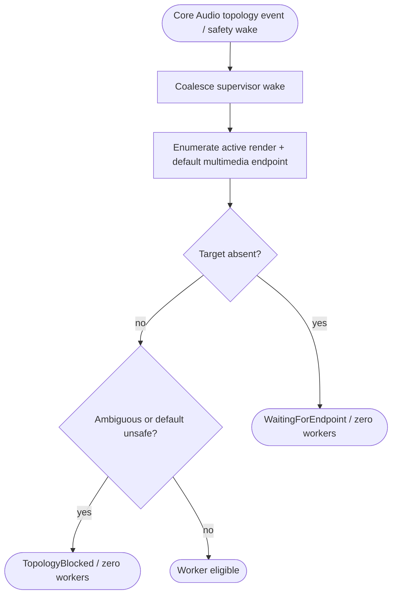

<!--vf:node
schema "vf-kb/0.1"
id "leaudio-router.round4-shell.endpoint-lifecycle"
kind "behavior"
parent "leaudio-router.round4-shell"
coverage "mapped"
-->

<!--vf:summary
entry "Core Audio reports a topology change, or the low-frequency safety probe wakes supervision."
problem "Bluetooth reconnect notifications are noisy and endpoint absence must not be mistaken for a route fault that deserves worker churn."
behavior "Treat notification callbacks only as wake-ups, then re-enumerate active render endpoints and the current default multimedia endpoint; classify present reality before worker policy runs."
exit "The target is classified as Absent, Available, Ambiguous, or topology-blocked, and supervision acts on that fresh snapshot."
-->

<!--vf:source
id "observer"
repo "STanJK/LE-Audio-Relay"
rev "da3217f76a0632bdaf6fea25e9103dbef0298137"
path "Lifecycle/AudioEndpointObserver.cs"
symbol "AudioEndpointObserver"
-->

<!--vf:source
id "probe"
repo "STanJK/LE-Audio-Relay"
rev "da3217f76a0632bdaf6fea25e9103dbef0298137"
path "Lifecycle/AudioEndpointProbe.cs"
symbol "AudioEndpointProbe"
-->

<!--vf:source
id "supervisor"
repo "STanJK/LE-Audio-Relay"
rev "da3217f76a0632bdaf6fea25e9103dbef0298137"
path "Supervision/BackendSupervisor.cs"
symbol "BackendSupervisor"
-->

<!--vf:source
id "adr"
repo "STanJK/LE-Audio-Relay"
rev "da3217f76a0632bdaf6fea25e9103dbef0298137"
path "docs/decisions/0002-event-driven-endpoint-reconciliation.md"
-->

<!--vf:claim
id "notification-is-wake-only"
type "fact"
text "Core Audio callbacks only raise TopologyChanged; they do not enumerate endpoints, dispose route objects, or run recovery policy."
evidence "observer"
evidence "adr"
-->

<!--vf:claim
id "probe-is-authoritative"
type "fact"
text "After wake-up, AudioEndpointProbe re-enumerates active render endpoints and the current default multimedia endpoint; notification order is not used as the state machine."
evidence "probe"
evidence "adr"
-->

<!--vf:claim
id "current-target-match-is-name-based"
type "fact"
text "The current Daily 2 implementation classifies the target by requiring exactly one Active render endpoint whose FriendlyName contains DestinationMatch."
evidence "probe"
-->

<!--vf:claim
id "absence-means-zero-workers"
type "fact"
text "When the fresh snapshot reports the target Absent, supervision stops any current generation, enters WaitingForEndpoint, and creates no replacement worker until topology becomes eligible again."
evidence "supervisor"
-->

**Why:** An endpoint notification means only that something changed; it does not say what stable topology now exists. [explain →](./round4-shell.fact.md#observers-report-facts-supervision-owns-policy)

**What:** Wake cheaply, enumerate truth, then let supervision reconcile worker existence. [explain →](./round4-shell.fact.md#observers-report-facts-supervision-owns-policy)

**Outcome:** Disconnect is quiet, reconnect is event-driven, and route-fault backoff is reserved for failures while topology remains eligible. [explain →](./round4-shell.fact.md#observers-report-facts-supervision-owns-policy)



<!--vf:pseudocode
node leaudio-router.round4-shell.endpoint-lifecycle
flow endpoint-reconciliation
audience human
purpose "Linear reading companion to the Mermaid flow; ignored by AI context by default."
-->
```text
ON endpoint notification:
    Wake()
    return immediately

ON reconciliation:
    enumerate active render endpoints
    resolve name-based target matches
    read default multimedia render endpoint

    IF target absent:
        ensure zero workers
        state = WAITING_FOR_ENDPOINT
    ELSE IF target ambiguous OR current default is unsafe:
        ensure zero workers
        state = TOPOLOGY_BLOCKED
    ELSE:
        expose eligible topology to worker-generation policy
```
<!--vf:end-->
