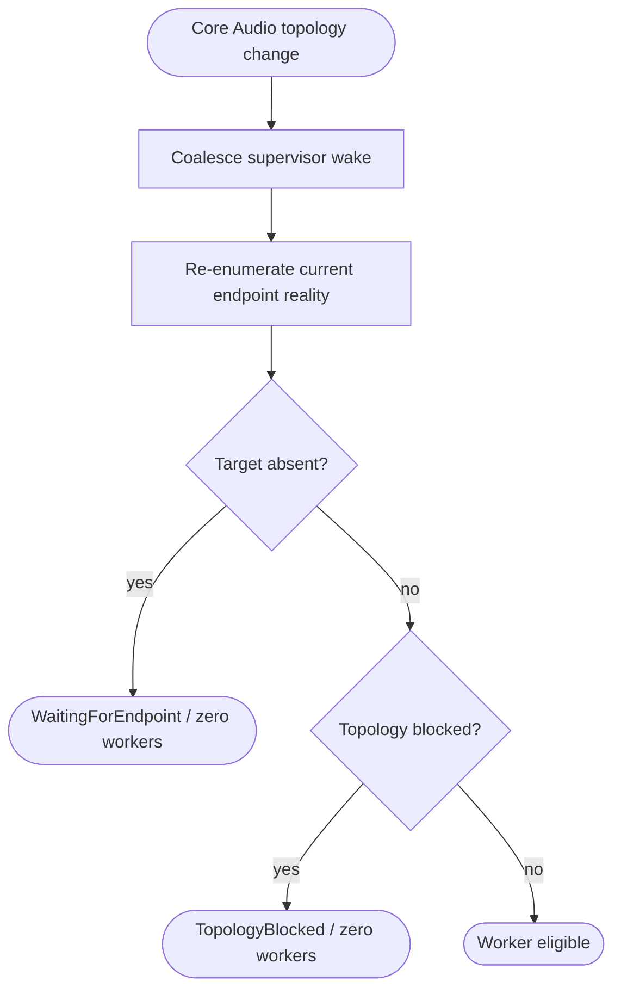

<!--vf:node
schema "vf-kb/0.1"
id "leaudio-router.round4-shell.endpoint-lifecycle"
kind "behavior"
parent "leaudio-router.round4-shell"
coverage "mapped"
-->

<!--vf:summary
entry "AudioEndpointObserver receives a Core Audio topology notification or the low-frequency safety probe timer expires."
problem "Physical endpoint absence must not be treated as a route fault that repeatedly spawns workers, while reconnect must still recover automatically."
behavior "Use notification callbacks only to coalesce a supervisor wake-up, then re-enumerate active render endpoints and the default render endpoint; classify the result as Absent, Available, Ambiguous, or topology-blocked and let supervision reconcile worker existence."
exit "The supervisor either waits with zero workers, blocks on invalid topology, or proceeds to maintain one route worker."
-->

<!--vf:source
id "observer"
repo "STanJK/le-audio-windows-relay"
rev "ad97006de6e95db08c2873a11aa2ee97ef5ad532"
path "Lifecycle/AudioEndpointObserver.cs"
symbol "AudioEndpointObserver"
-->

<!--vf:source
id "probe"
repo "STanJK/le-audio-windows-relay"
rev "ad97006de6e95db08c2873a11aa2ee97ef5ad532"
path "Lifecycle/AudioEndpointProbe.cs"
symbol "AudioEndpointProbe"
-->

<!--vf:source
id "snapshot"
repo "STanJK/le-audio-windows-relay"
rev "ad97006de6e95db08c2873a11aa2ee97ef5ad532"
path "Lifecycle/AudioEndpointSnapshot.cs"
symbol "AudioEndpointSnapshot"
-->

<!--vf:source
id "supervisor"
repo "STanJK/le-audio-windows-relay"
rev "ad97006de6e95db08c2873a11aa2ee97ef5ad532"
path "Supervision/BackendSupervisor.cs"
symbol "BackendSupervisor"
-->

<!--vf:source
id "adr"
repo "STanJK/le-audio-windows-relay"
rev "ad97006de6e95db08c2873a11aa2ee97ef5ad532"
path "docs/decisions/0002-event-driven-endpoint-reconciliation.md"
-->

<!--vf:claim
id "notification-is-wake-only"
type "fact"
text "AudioEndpointObserver uses NAudio endpoint notifications only to raise a cheap TopologyChanged wake-up; it performs no endpoint enumeration, worker control, or audio-object disposal in the callback."
evidence "observer"
evidence "adr"
-->

<!--vf:claim
id "enumeration-is-authoritative"
type "fact"
text "AudioEndpointProbe re-enumerates active render endpoints and the default multimedia render endpoint after wake-up; notification payload/order is not treated as authoritative topology."
evidence "probe"
evidence "adr"
-->

<!--vf:claim
id "absent-target-means-zero-workers"
type "fact"
text "When the authoritative probe reports the target endpoint Absent, BackendSupervisor stops any current worker, enters WaitingForEndpoint, and does not spawn replacement workers."
evidence "supervisor"
-->

<!--vf:claim
id "safety-probe-does-not-reconnect"
type "fact"
text "Waiting/blocked states use a 30-second safety wake only to re-probe topology; a worker is still created only after the probe reports eligible reality."
evidence "supervisor"
evidence "adr"
-->

<!--vf:claim
id "backoff-is-for-real-route-faults"
type "fact"
text "Bounded 1/2/5/10/30-second recovery backoff applies when topology remains eligible but route/worker startup or runtime fails."
evidence "supervisor"
evidence "adr"
-->

**Why:** A disconnected Bluetooth endpoint is an observed system state, not a backend failure, so worker churn during absence is both noisy and semantically wrong. [explain →](./round4-shell.fact.md#lifecycle-why)

**What:** Core Audio notifications wake supervision; a fresh enumeration produces the current endpoint snapshot; supervision maps that snapshot to WaitingForEndpoint, TopologyBlocked, or worker eligibility. [explain →](./round4-shell.fact.md#lifecycle-what)

**Outcome:** Disconnect produces zero worker churn, reconnect is event-driven and silent, and bounded retry is reserved for genuine route failures while the endpoint remains present. [explain →](./round4-shell.fact.md#lifecycle-outcome)



<!--vf:pseudocode
node leaudio-router.round4-shell.endpoint-lifecycle
flow endpoint-reconciliation
audience human
purpose "Linear reading companion to the Mermaid flow; ignored by AI context by default."
-->
```text
ON Core Audio endpoint add/remove/state/default change:
    signal supervisor wake
    RETURN immediately

ON supervisor wake:
    enumerate active render endpoints
    find active endpoints matching configured Buds destination
    read current default multimedia render endpoint

    IF no active target exists:
        stop stale worker if any
        state = WAITING_FOR_ENDPOINT
        DO NOT spawn a worker

    ELSE IF multiple active targets match
         OR default render is Buds/CABLE/unavailable:
        stop stale worker if any
        state = TOPOLOGY_BLOCKED
        DO NOT spawn a worker

    ELSE:
        endpoint reality is eligible
        allow worker-generation reconciliation

WHILE waiting/blocked:
    wait for next topology notification
    OR perform one low-frequency 30 s safety re-probe

IF worker/route fails while reality remains eligible:
    use bounded fault recovery backoff
```
<!--vf:end-->
