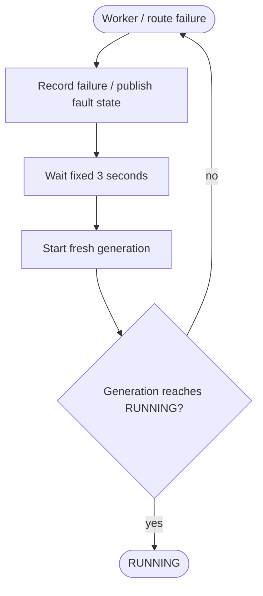

<!--vf:node
schema "vf-kb/0.1"
id "leaudio-router.round4-shell.worker-generation.fixed-retry-recovery"
kind "behavior"
parent "leaudio-router.round4-shell.worker-generation"
coverage "mapped"
-->

<!--vf:summary
entry "The active worker generation completes or route startup throws while the Tray application remains alive."
problem "V0.20.1 needs automatic recovery before endpoint lifecycle observation exists."
behavior "Treat worker/route completion or startup failure as a generic backend fault, wait one fixed three-second recovery delay, then reconcile again and spawn a fresh generation if no current worker exists."
exit "A later generation reaches RUNNING, or repeated three-second recovery cycles continue while the underlying failure persists."
-->

<!--vf:source
id "supervisor"
repo "STanJK/le-audio-windows-relay"
rev "2146e3e7a58fbebaba530034d67b434e007a8b08"
path "Supervision/BackendSupervisor.cs"
symbol "BackendSupervisor"
-->

<!--vf:source
id "route"
repo "STanJK/le-audio-windows-relay"
rev "2146e3e7a58fbebaba530034d67b434e007a8b08"
path "Routing/RouteSession.cs"
symbol "RouteSession"
-->

<!--vf:source
id "architecture"
repo "STanJK/le-audio-windows-relay"
rev "2146e3e7a58fbebaba530034d67b434e007a8b08"
path "docs/ARCHITECTURE.md"
-->

<!--vf:claim
id "recovery-delay-is-three-seconds"
type "fact"
text "V0.20.1 BackendSupervisor defines RecoveryDelay as a fixed TimeSpan.FromSeconds(3) and waits that delay after worker completion or generation startup failure."
evidence "supervisor"
-->

<!--vf:claim
id "recovery-is-topology-agnostic"
type "fact"
text "V0.20.1 does not probe target endpoint availability before the next recovery attempt; endpoint lifecycle observation is still future work."
evidence "supervisor"
evidence "architecture"
-->

<!--vf:claim
id "disconnect-can-cause-worker-churn"
type "inference"
text "Because endpoint absence is not distinguished from other route failures, a persistent disconnect can cause repeated short-lived worker generations at approximately the fixed recovery interval."
evidence "supervisor"
-->

**Why:** V0.20.1 needed automatic recovery while the Round4 endpoint-observation layer had not yet been implemented. [explain →](./v0.20.1.fact.md#why)

**What:** All worker/route failure paths converge on one fixed three-second delay before supervision attempts another generation. [explain →](./v0.20.1.fact.md#what)

**Outcome:** The build automatically recovers when a transient fault clears, but persistent endpoint absence produces repeated generation attempts until the endpoint returns. [explain →](./v0.20.1.fact.md#outcome)



<!--vf:pseudocode
node leaudio-router.round4-shell.worker-generation.fixed-retry-recovery
flow fixed-retry-recovery
audience human
purpose "Historical implementation-aware projection of V0.20.1 recovery behavior."
-->
```text
IF current worker generation completes:
    collect failure reason
    dispose the generation
    clear current generation
    wait 3 seconds
    reconcile again

IF starting a generation throws:
    record the error
    publish fault state
    wait 3 seconds
    reconcile again

ON next reconcile:
    IF no generation exists:
        spawn generation N+1
        attempt RouteSession startup

NOTE:
    this version does not first ask whether the target endpoint is absent
    therefore endpoint absence and genuine route faults share the same retry path
```
<!--vf:end-->
