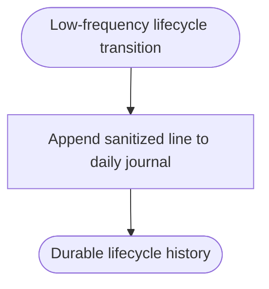

<!--vf:node
schema "vf-kb/0.1"
id "leaudio-router.round4-shell.lifecycle-journal"
kind "behavior"
parent "leaudio-router.round4-shell"
coverage "mapped"
-->

<!--vf:summary
entry "A low-frequency application, power, endpoint, worker, mode, or restart transition occurs."
problem "Multi-day validation needs durable lifecycle evidence without heartbeat/ring telemetry becoming persistent log noise."
behavior "Append one sanitized best-effort UTF-8 line to a daily LocalApplicationData journal only for lifecycle transitions."
exit "Lifecycle history survives process restarts while high-frequency route telemetry remains worker-local and ephemeral."
-->

<!--vf:source
id "logger"
repo "STanJK/LE-Audio-Relay"
rev "da3217f76a0632bdaf6fea25e9103dbef0298137"
path "Telemetry/LifecycleEventLog.cs"
symbol "LifecycleEventLog"
-->

<!--vf:source
id "supervisor"
repo "STanJK/LE-Audio-Relay"
rev "da3217f76a0632bdaf6fea25e9103dbef0298137"
path "Supervision/BackendSupervisor.cs"
symbol "BackendSupervisor"
-->

<!--vf:source
id "shell"
repo "STanJK/LE-Audio-Relay"
rev "da3217f76a0632bdaf6fea25e9103dbef0298137"
path "Shell/TrayApplicationContext.cs"
symbol "TrayApplicationContext"
-->

<!--vf:claim
id "journal-is-best-effort"
type "fact"
text "LifecycleEventLog catches its own I/O failures, so persistent logging cannot block product routing or recovery."
evidence "logger"
-->

<!--vf:claim
id "journal-excludes-high-frequency-telemetry"
type "fact"
text "The persistent journal is written from shell/supervision lifecycle transitions and does not persist heartbeat, ring occupancy, overflow warnings, drift warnings, or per-second route telemetry."
evidence "logger"
evidence "supervisor"
evidence "shell"
-->

**Why:** The journal exists for reconstruction after long daily runs, not for real-time audio diagnostics. [explain →](./lifecycle-journal.fact.md#why)

**What:** Persist only coarse lifecycle transitions under `%LOCALAPPDATA%/LEAudioRelay/logs`. [explain →](./lifecycle-journal.fact.md#what)

**Outcome:** Failures can be correlated with reconnect, power, worker, and user actions without making logging part of the audio critical path. [explain →](./lifecycle-journal.fact.md#outcome)



<!--vf:pseudocode
node leaudio-router.round4-shell.lifecycle-journal
flow lifecycle-journal
audience human
purpose "Linear reading companion to the Mermaid flow; ignored by AI context by default."
-->
```text
ON low-frequency lifecycle transition:
    sanitize optional detail
    append one timestamped UTF-8 line to today's lifecycle log
    ignore logging I/O failures

DO NOT persist:
    heartbeat
    ring occupancy
    overflow warnings
    drift warnings
    per-second route telemetry
```
<!--vf:end-->
