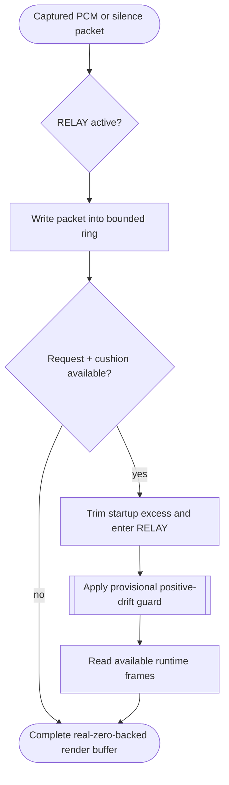

<!--vf:node
schema "vf-kb/0.1"
id "leaudio-router.round4-shell.worker-generation.route-session.pcm-relay-boundary"
kind "behavior"
parent "leaudio-router.round4-shell.worker-generation.route-session"
coverage "mapped"
-->

<!--vf:summary
entry "Process Loopback capture pushes 48 kHz stereo audio or silent packets into PcmRelayBoundary while the destination provider requests render buffers."
problem "Capture and render callbacks require one elastic PCM boundary while the destination must continuously receive complete real-zero-backed buffers before activation and during missing runtime data."
behavior "Use one SPSC ring, cap pre-activation accumulation, activate RELAY only after the current request plus target cushion is available, trim startup excess, read available runtime frames, and leave missing output as real zeros."
exit "Every render callback returns a complete buffer while route telemetry separately records audio drops, silent drops, keepalive frames, zero-fill frames, and startup trim."
-->

<!--vf:source
id "boundary"
repo "STanJK/le-audio-windows-relay"
rev "e7965f4b1fc34dcbf28d1f3e86406ef4b58e2df2"
path "Timing/PcmRelayBoundary.cs"
symbol "PcmRelayBoundary"
-->

<!--vf:source
id "ring"
repo "STanJK/le-audio-windows-relay"
rev "e7965f4b1fc34dcbf28d1f3e86406ef4b58e2df2"
path "Timing/SpscPcmRing.cs"
symbol "SpscPcmRing"
-->

<!--vf:source
id "telemetry"
repo "STanJK/le-audio-windows-relay"
rev "e7965f4b1fc34dcbf28d1f3e86406ef4b58e2df2"
path "Telemetry/RouteTelemetry.cs"
symbol "RouteTelemetry"
-->

<!--vf:claim
id "activation-requires-request-plus-cushion"
type "fact"
text "ARMED changes to RELAY only when ring fill reaches the current render request plus the configured target cushion."
evidence "boundary"
-->

<!--vf:claim
id "render-is-real-zero-backed"
type "fact"
text "PcmRelayBoundary clears every destination buffer before reading ring data, so keepalive and missing runtime frames remain real zero PCM."
evidence "boundary"
-->

<!--vf:claim
id "drop-semantics-are-separated"
type "fact"
text "Round4 telemetry records runtime dropped audio frames separately from runtime dropped silent frames and also separates startup drops."
evidence "telemetry"
-->

**Why:** The route still needs one minimal elasticity boundary, but clock-control policy must remain separable from basic PCM transport. [explain →](./round4-shell.fact.md#pcm-why)

**What:** The boundary preserves startup cushion and zero-keepalive behavior with one SPSC ring while exposing cleaner drop semantics than V0.1. [explain →](./round4-shell.fact.md#pcm-what)

**Outcome:** The current route can run with the validated V0.1 buffering behavior while later drift/recenter logic can be added as a distinct Timing control layer. [explain →](./round4-shell.fact.md#pcm-outcome)



<!--vf:pseudocode
node leaudio-router.round4-shell.worker-generation.route-session.pcm-relay-boundary
flow pcm-boundary
audience human
purpose "Linear reading companion to the Mermaid flow; ignored by AI context by default."
-->
```text
ON capture packet:
    classify packet as audio or silent
    choose startup or runtime fill limit
    write packet frames into the SPSC ring
    record written and dropped frames with audio/silence identity preserved

ON destination render request:
    clear the entire output buffer to real zeros

    IF mode is ARMED:
        required = current request + target cushion

        IF ring fill >= required:
            discard excess above required
            enter RELAY

    IF mode is RELAY:
        read available frames from ring
        leave any missing frames as zeros
    ELSE:
        return zero keepalive

    record render/zero-fill/keepalive telemetry
```
<!--vf:end-->
