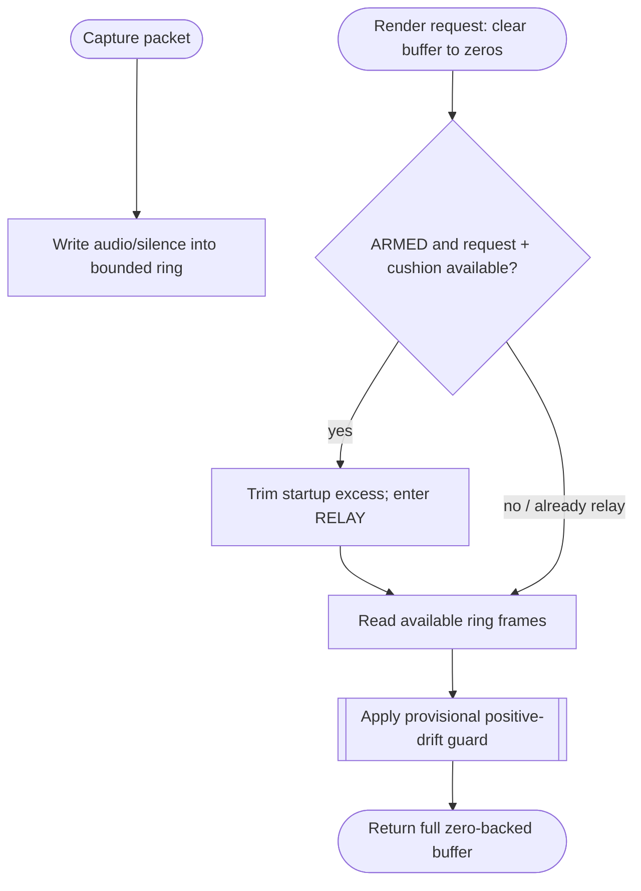

<!--vf:node
schema "vf-kb/0.1"
id "leaudio-router.round4-shell.worker-generation.route-session.pcm-relay-boundary"
kind "behavior"
parent "leaudio-router.round4-shell.worker-generation.route-session"
coverage "mapped"
-->

<!--vf:summary
entry "Process Loopback pushes 48 kHz stereo packets while the destination renderer requests output buffers on an independent callback clock."
problem "The destination must always receive a complete buffer and remain hot, while capture/render phase mismatch still needs a small elasticity boundary."
behavior "Use one SPSC ring and KEEPALIVE→ARMED→RELAY state: zero-fill every render buffer first, bound startup accumulation, enter RELAY only after current request plus 10 ms target cushion is available, then read available frames and leave any deficit as real zeros."
exit "Render callbacks always return a full buffer; startup trim, audio/silent drops, zero-fill, keepalive, and intentional clock trims remain distinguishable telemetry."
-->

<!--vf:source
id "boundary"
repo "STanJK/LE-Audio-Relay"
rev "da3217f76a0632bdaf6fea25e9103dbef0298137"
path "Timing/PcmRelayBoundary.cs"
symbol "PcmRelayBoundary"
-->

<!--vf:source
id "ring"
repo "STanJK/LE-Audio-Relay"
rev "da3217f76a0632bdaf6fea25e9103dbef0298137"
path "Timing/SpscPcmRing.cs"
symbol "SpscPcmRing"
-->

<!--vf:source
id "telemetry"
repo "STanJK/LE-Audio-Relay"
rev "da3217f76a0632bdaf6fea25e9103dbef0298137"
path "Telemetry/RouteTelemetry.cs"
symbol "RouteTelemetry"
-->

<!--vf:claim
id "activation-needs-request-plus-cushion"
type "fact"
text "ARMED enters RELAY only when ring fill can satisfy the current render request plus the configured 10 ms target cushion; excess startup fill is discarded at activation."
evidence "boundary"
-->

<!--vf:claim
id "render-is-zero-backed"
type "fact"
text "Every destination buffer is cleared before ring data is read, so KEEPALIVE and missing runtime frames remain real zero PCM while the destination render stream stays active."
evidence "boundary"
-->

<!--vf:claim
id "capacity-is-headroom-not-target"
type "fact"
text "The physical ring capacity is 80 ms while the intended retained cushion is 10 ms; capacity is safety headroom rather than normal latency."
evidence "boundary"
evidence "ring"
-->

<!--vf:claim
id "loss-and-correction-semantics-are-separated"
type "fact"
text "RouteTelemetry separates startup/runtime audio drops, silent drops, startup trim, zero-fill, and intentional silent/gradual/emergency clock correction."
evidence "telemetry"
-->

**Why:** Keepalive and minimal scheduling elasticity are transport invariants; full clock control is a separate concern.

**What:** One SPSC boundary owns startup gating, retained cushion, zero-backed render, and drop accounting.

**Outcome:** The destination stays continuously rendered without treating the full 80 ms capacity as normal queue latency.



<!--vf:pseudocode
node leaudio-router.round4-shell.worker-generation.route-session.pcm-relay-boundary
flow pcm-boundary
audience human
purpose "Callback-order and buffer invariant projection."
-->
```text
ON capture packet:
    preserve audio-vs-silent identity
    before RELAY: cap fill at startup hold
    during RELAY: cap fill at physical capacity
    prefer silent excess suppression through drift child
    record writes and real drops separately

ON render request:
    clear full output buffer to zero

    IF ARMED and fill >= request + target cushion:
        discard startup excess
        enter RELAY

    IF RELAY:
        read available frames
        apply post-render drift child

    leave any missing bytes as zeros
    return full requested byte count
```
<!--vf:end-->
