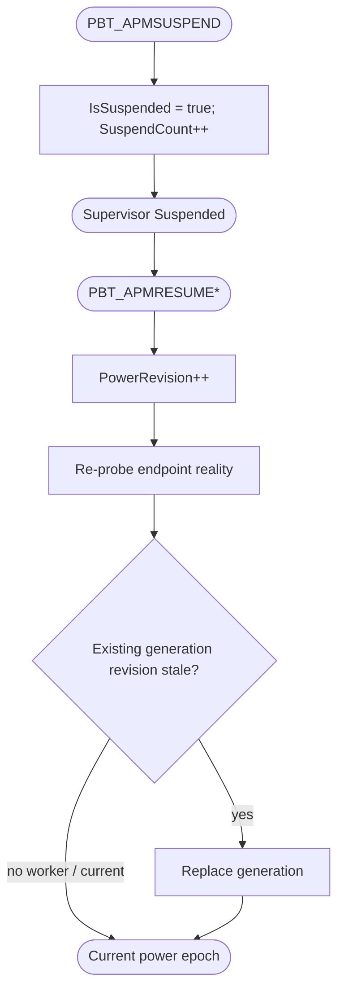

<!--vf:node
schema "vf-kb/0.1"
id "leaudio-router.round4-shell.power-lifecycle"
kind "behavior"
parent "leaudio-router.round4-shell"
coverage "mapped"
-->

<!--vf:summary
entry "The Tray process receives WM_POWERBROADCAST suspend/resume messages."
problem "A route created before suspend must not be trusted after resume, while the Windows power callback itself must stay cheap and nonblocking."
behavior "PowerObserver updates only PowerSnapshot and wakes supervision; resume advances PowerRevision, and any generation created under an older revision becomes stale."
exit "No new worker is created while suspended; after resume, endpoint reality is re-probed and only a current-revision generation may return to Running."
-->

<!--vf:source
id "observer"
repo "STanJK/LE-Audio-Relay"
rev "da3217f76a0632bdaf6fea25e9103dbef0298137"
path "Lifecycle/PowerObserver.cs"
symbol "PowerObserver"
-->

<!--vf:source
id "snapshot"
repo "STanJK/LE-Audio-Relay"
rev "da3217f76a0632bdaf6fea25e9103dbef0298137"
path "Lifecycle/PowerSnapshot.cs"
symbol "PowerSnapshot"
-->

<!--vf:source
id "supervisor"
repo "STanJK/LE-Audio-Relay"
rev "da3217f76a0632bdaf6fea25e9103dbef0298137"
path "Supervision/BackendSupervisor.cs"
symbol "BackendSupervisor"
-->

<!--vf:source
id "adr"
repo "STanJK/LE-Audio-Relay"
rev "da3217f76a0632bdaf6fea25e9103dbef0298137"
path "docs/decisions/0003-power-revision-route-invalidation.md"
-->

<!--vf:claim
id "callback-is-fact-only"
type "fact"
text "PowerObserver updates PowerSnapshot and raises Changed from WM_POWERBROADCAST handling; it does not enumerate endpoints or touch WASAPI route objects."
evidence "observer"
evidence "adr"
-->

<!--vf:claim
id "resume-invalidates-generation"
type "fact"
text "Each WorkerGeneration records the PowerRevision at creation, and BackendSupervisor treats a revision mismatch as stale generation evidence after resume."
evidence "supervisor"
-->

<!--vf:claim
id "suspended-means-no-new-worker"
type "fact"
text "While IsSuspended is true, supervision publishes Suspended and waits; it does not create a new worker generation."
evidence "supervisor"
-->

**Why:** Suspend/resume is treated as a route-generation boundary instead of teaching every WASAPI object to survive sleep. [explain →](./round4-shell.fact.md#observers-report-facts-supervision-owns-policy)

**What:** Power callbacks produce a revisioned fact; supervision owns replacement. [explain →](./round4-shell.fact.md#observers-report-facts-supervision-owns-policy)

**Outcome:** A route generation is never trusted across a suspend/resume cycle. [explain →](./round4-shell.fact.md#observers-report-facts-supervision-owns-policy)



<!--vf:pseudocode
node leaudio-router.round4-shell.power-lifecycle
flow power-lifecycle
audience human
purpose "Linear reading companion to the Mermaid flow; ignored by AI context by default."
-->
```text
ON suspend:
    mark suspended
    increment SuspendCount
    wake supervision

ON resume:
    mark awake
    increment PowerRevision
    wake supervision

SUPERVISOR:
    create no worker while suspended
    after resume, re-probe endpoints
    replace any worker created under an older PowerRevision
```
<!--vf:end-->
