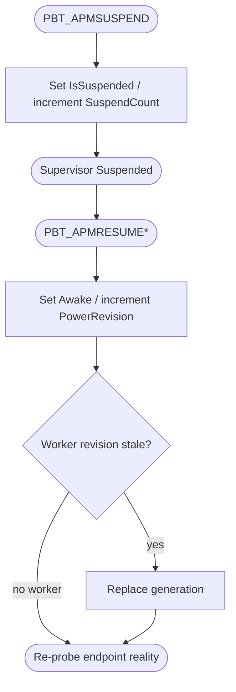

<!--vf:node
schema "vf-kb/0.1"
id "leaudio-router.round4-shell.power-lifecycle"
kind "behavior"
parent "leaudio-router.round4-shell"
coverage "mapped"
-->

<!--vf:summary
entry "The Tray process receives WM_POWERBROADCAST suspend/resume messages through PowerObserver."
problem "A route generation created before Windows suspend must not be assumed trustworthy after resume, while the suspend callback itself must remain nonblocking."
behavior "Convert WM_POWERBROADCAST into an in-memory PowerSnapshot and wake supervision; increment PowerRevision on resume; do not create workers while suspended; replace any worker generation whose stored PowerRevision predates the current revision."
exit "After resume, endpoint reality is re-probed and only a fresh post-resume generation may return to RUNNING."
-->

<!--vf:source
id "observer"
repo "STanJK/le-audio-windows-relay"
rev "e7965f4b1fc34dcbf28d1f3e86406ef4b58e2df2"
path "Lifecycle/PowerObserver.cs"
symbol "PowerObserver"
-->

<!--vf:source
id "snapshot"
repo "STanJK/le-audio-windows-relay"
rev "e7965f4b1fc34dcbf28d1f3e86406ef4b58e2df2"
path "Lifecycle/PowerSnapshot.cs"
symbol "PowerSnapshot"
-->

<!--vf:source
id "supervisor"
repo "STanJK/le-audio-windows-relay"
rev "e7965f4b1fc34dcbf28d1f3e86406ef4b58e2df2"
path "Supervision/BackendSupervisor.cs"
symbol "BackendSupervisor"
-->

<!--vf:source
id "adr"
repo "STanJK/le-audio-windows-relay"
rev "e7965f4b1fc34dcbf28d1f3e86406ef4b58e2df2"
path "docs/decisions/0003-power-revision-route-invalidation.md"
-->

<!--vf:claim
id "power-callback-is-fact-only"
type "fact"
text "PowerObserver handles WM_POWERBROADCAST by updating PowerSnapshot and raising Changed; WASAPI teardown/rebuild remains outside the window callback."
evidence "observer"
evidence "adr"
-->

<!--vf:claim
id "resume-invalidates-old-generation"
type "fact"
text "BackendSupervisor stores the PowerRevision of each WorkerGeneration and treats a generation as stale when its revision differs from the current PowerSnapshot revision."
evidence "supervisor"
-->

<!--vf:claim
id "suspended-state-does-not-create-workers"
type "fact"
text "While PowerSnapshot.IsSuspended is true, supervision publishes Suspended and waits for another wake without creating a new worker generation."
evidence "supervisor"
-->

**Why:** Sleep/resume is a lifecycle boundary for the whole route generation, not a condition every individual WASAPI object should be taught to survive. [explain →](./round4-shell.fact.md#power-why)

**What:** A tiny power observer records suspend/resume facts; supervision uses PowerRevision to invalidate and replace pre-resume generations. [explain →](./round4-shell.fact.md#power-what)

**Outcome:** Every route generation that reaches RUNNING after resume is newly constructed in the current power epoch. [explain →](./round4-shell.fact.md#power-outcome)



<!--vf:pseudocode
node leaudio-router.round4-shell.power-lifecycle
flow power-lifecycle
audience human
purpose "Implementation-aware projection of suspend/resume reconciliation."
-->
```text
ON PBT_APMSUSPEND:
    set PowerSnapshot.IsSuspended = true
    increment SuspendCount
    wake Supervisor
    return immediately

WHILE suspended:
    create no new worker
    wait for a lifecycle wake

ON first resume event for this suspend:
    set IsSuspended = false
    increment PowerRevision
    wake Supervisor

SUPERVISOR:
    re-probe endpoint reality

    IF current worker exists
       AND worker.PowerRevision != current PowerRevision:
        replace the entire worker generation

    only a fresh current-revision generation may return to RUNNING
```
<!--vf:end-->
