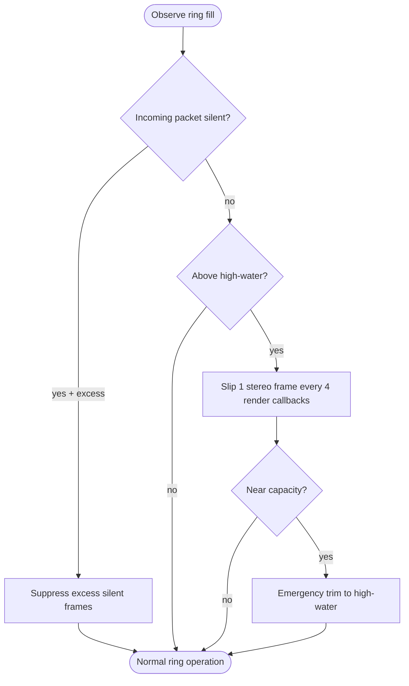

<!--vf:node
schema "vf-kb/0.1"
id "leaudio-router.round4-shell.worker-generation.route-session.pcm-relay-boundary.provisional-positive-drift-guard"
kind "behavior"
parent "leaudio-router.round4-shell.worker-generation.route-session.pcm-relay-boundary"
coverage "mapped"
-->

<!--vf:summary
entry "The active PCM relay ring accumulates positive fill drift above its normal target cushion."
problem "The daily-use baseline can otherwise leave the finite ring pinned at capacity before a proper clock synchronization controller is designed."
behavior "Preferentially suppress excess source-declared silence; if uninterrupted audio still crosses the high-water band, discard one stereo frame every four render callbacks until fill returns below the low-water band; use a hard emergency trim only near capacity."
exit "Ring fill is kept away from permanent saturation while intentional correction remains separately observable from real runtime drops."
-->

<!--vf:source
id "guard"
repo "STanJK/le-audio-windows-relay"
rev "e7965f4b1fc34dcbf28d1f3e86406ef4b58e2df2"
path "Timing/ProvisionalPositiveDriftGuard.cs"
symbol "ProvisionalPositiveDriftGuard"
-->

<!--vf:source
id "boundary"
repo "STanJK/le-audio-windows-relay"
rev "e7965f4b1fc34dcbf28d1f3e86406ef4b58e2df2"
path "Timing/PcmRelayBoundary.cs"
symbol "PcmRelayBoundary"
-->

<!--vf:source
id "telemetry"
repo "STanJK/le-audio-windows-relay"
rev "e7965f4b1fc34dcbf28d1f3e86406ef4b58e2df2"
path "Telemetry/RouteTelemetry.cs"
symbol "RouteTelemetry"
-->

<!--vf:source
id "adr"
repo "STanJK/le-audio-windows-relay"
rev "e7965f4b1fc34dcbf28d1f3e86406ef4b58e2df2"
path "docs/decisions/0004-provisional-positive-drift-guard.md"
-->

<!--vf:claim
id "guard-is-not-clock-sync"
type "fact"
text "ADR 0004 explicitly defines the guard as provisional one-sided mitigation rather than PLL, ASRC, drift estimation, or final clock synchronization."
evidence "adr"
-->

<!--vf:claim
id "silence-is-preferred-correction"
type "fact"
text "During source-declared silence, PcmRelayBoundary suppresses silent input above the target cushion before using render-side frame slips."
evidence "boundary"
evidence "guard"
-->

<!--vf:claim
id "gradual-trim-is-stereo-frame-aligned"
type "fact"
text "When fill stays above the high-water band, ProvisionalPositiveDriftGuard discards at most one complete ring frame every four render callbacks until fill returns below the low-water band."
evidence "guard"
-->

<!--vf:claim
id "intentional-trim-is-not-runtime-drop"
type "fact"
text "RouteTelemetry stores silent, gradual, and emergency clock-trim counters separately and subtracts intentional silent trim from runtime dropped-frame accounting."
evidence "telemetry"
-->

**Why:** Daily-use validation needs protection from ring saturation without prematurely committing to the final clock-control design. [explain →](./round4-shell.fact.md#drift-why)

**What:** The provisional guard uses silence-first correction, slow stereo-frame slip under continuous audio, and a near-capacity emergency trim. [explain →](./round4-shell.fact.md#drift-what)

**Outcome:** Positive drift should no longer leave the ring permanently full, while future formal Timing work can replace this guard as one bounded module. [explain →](./round4-shell.fact.md#drift-outcome)



<!--vf:pseudocode
node leaudio-router.round4-shell.worker-generation.route-session.pcm-relay-boundary.provisional-positive-drift-guard
flow positive-drift-guard
audience human
purpose "Historical projection of the temporary daily-use drift mitigation."
-->
```text
ON silent capture packet:
    IF ring fill > target cushion:
        suppress up to the excess number of silent input frames
        record ClockSilentTrimFrames
        do not count those frames as runtime drops

BEFORE render read:
    IF fill is near capacity:
        discard queued frames back to the high-water band
        record ClockEmergencyTrimFrames

    ELSE IF fill crossed high-water:
        enter gradual-trim mode

    WHILE gradual-trim mode AND fill > low-water:
        every 4 render callbacks:
            discard exactly 1 complete stereo frame
            record ClockGradualTrimFrames

    IF fill <= low-water:
        leave gradual-trim mode

NOTE:
    this is positive-drift mitigation only
    it is not final clock synchronization
```
<!--vf:end-->
