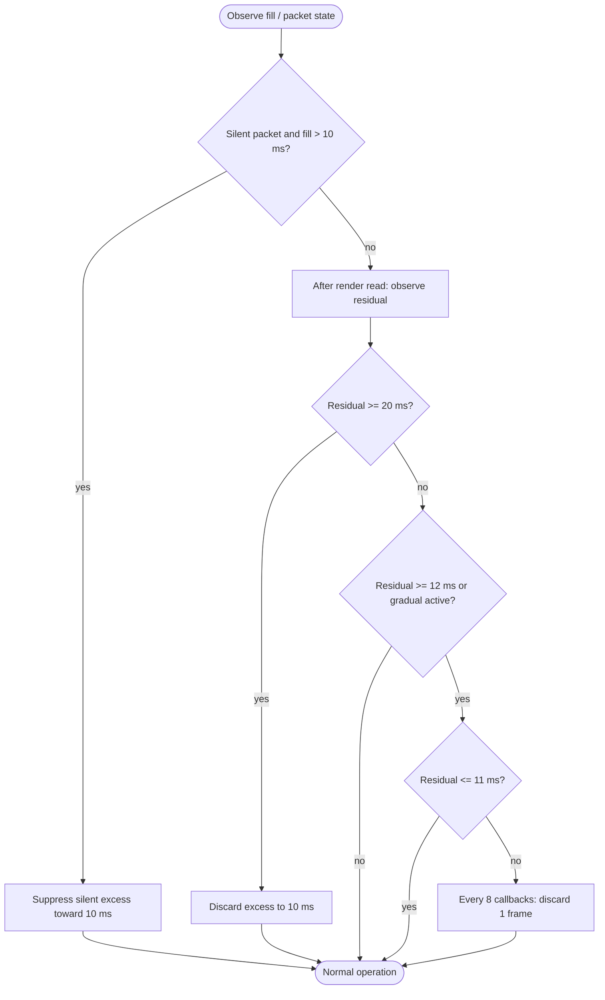

<!--vf:node
schema "vf-kb/0.1"
id "leaudio-router.round4-shell.worker-generation.route-session.pcm-relay-boundary.provisional-positive-drift-guard"
kind "behavior"
parent "leaudio-router.round4-shell.worker-generation.route-session.pcm-relay-boundary"
coverage "mapped"
-->

<!--vf:summary
entry "After RELAY is active, producer/consumer clock mismatch causes retained ring fill to drift above the 10 ms target cushion."
problem "Positive drift can otherwise grow retained latency and eventually pin the finite ring at capacity before a formal clock synchronizer exists."
behavior "Use one-sided post-render residual control: prefer source-declared silence suppression, start gradual one-stereo-frame slips at 12 ms residual, stop at 11 ms, and hard-recenter to 10 ms if residual reaches 20 ms."
exit "Positive fill is kept away from long-term saturation while intentional correction remains separately observable and replaceable by future clock-control work."
-->

<!--vf:source
id "guard"
repo "STanJK/LE-Audio-Relay"
rev "da3217f76a0632bdaf6fea25e9103dbef0298137"
path "Timing/ProvisionalPositiveDriftGuard.cs"
symbol "ProvisionalPositiveDriftGuard"
-->

<!--vf:source
id "boundary"
repo "STanJK/LE-Audio-Relay"
rev "da3217f76a0632bdaf6fea25e9103dbef0298137"
path "Timing/PcmRelayBoundary.cs"
symbol "PcmRelayBoundary"
-->

<!--vf:source
id "telemetry"
repo "STanJK/LE-Audio-Relay"
rev "da3217f76a0632bdaf6fea25e9103dbef0298137"
path "Telemetry/RouteTelemetry.cs"
symbol "RouteTelemetry"
-->

<!--vf:source
id "adr"
repo "STanJK/LE-Audio-Relay"
rev "da3217f76a0632bdaf6fea25e9103dbef0298137"
path "docs/decisions/0004-provisional-positive-drift-guard.md"
-->

<!--vf:claim
id "guard-is-not-clock-sync"
type "fact"
text "ADR 0004 defines this as provisional positive-drift mitigation, not PLL, ASRC, drift estimation, negative-drift control, or finished clock synchronization."
evidence "adr"
-->

<!--vf:claim
id "silence-is-preferred"
type "fact"
text "During source-declared silence, incoming silent frames are suppressed only to remove already-accumulated fill above the target cushion before render-side slipping is needed."
evidence "guard"
evidence "boundary"
-->

<!--vf:claim
id "gradual-band-is-11-to-12ms"
type "fact"
text "Gradual mode starts at target + 2 ms, stops at target + 1 ms, and discards one complete ring frame every eight render callbacks while active."
evidence "guard"
-->

<!--vf:claim
id "hard-recenter-is-20-to-10ms"
type "fact"
text "If post-render residual reaches target + 10 ms, the guard discards the excess directly back to the 10 ms target and resets gradual state."
evidence "guard"
-->

**Why:** Daily-use validation needs bounded retained fill without prematurely turning a temporary heuristic into the final timing architecture.

**What:** Control only positive residual drift around the 10 ms cushion with silence-first, gradual, then emergency correction.

**Outcome:** Ring saturation is mitigated while the algorithm stays an explicitly provisional child of the PCM boundary.



<!--vf:pseudocode
node leaudio-router.round4-shell.worker-generation.route-session.pcm-relay-boundary.provisional-positive-drift-guard
flow positive-drift-guard
audience human
purpose "Exact current one-sided control thresholds and correction order."
-->
```text
ON silent capture packet:
    suppress at most current fill - 10 ms
    record ClockSilentTrimFrames

AFTER each render read:
    residual = ring fill

    IF residual >= 20 ms:
        discard residual - 10 ms
        record ClockEmergencyTrimFrames
        reset gradual state

    ELSE:
        enter gradual mode at >= 12 ms
        leave gradual mode at <= 11 ms

        while gradual mode:
            every 8 render callbacks discard 1 frame
            record ClockGradualTrimFrames

NOTE: intentional trim is not runtime overflow/drop accounting
```
<!--vf:end-->
