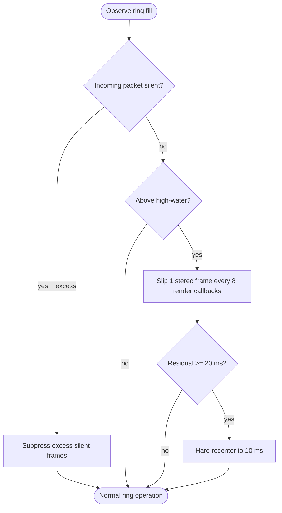

<!--vf:node
schema "vf-kb/0.1"
id "leaudio-router.round4-shell.worker-generation.route-session.pcm-relay-boundary.provisional-positive-drift-guard"
kind "behavior"
parent "leaudio-router.round4-shell.worker-generation.route-session.pcm-relay-boundary"
coverage "mapped"
-->

<!--vf:summary
entry "The active PCM relay ring accumulates positive fill drift above its normal target cushion."
problem "The daily-use baseline can otherwise leave the finite ring pinned at capacity before a proper clock synchronization controller is designed."
behavior "Regulate post-render residual fill around the 10 ms target cushion: prefer silence suppression, enter gradual trim at 12 ms residual, slip one stereo frame every eight render callbacks until residual returns to 11 ms, and hard-recenter to 10 ms if residual reaches 20 ms."
exit "Ring fill is kept away from permanent saturation while intentional correction remains separately observable from real runtime drops."
-->

<!--vf:source
id "guard"
repo "STanJK/le-audio-windows-relay"
rev "fcaea55d113f49c519ef45917fb6826e3d018db0"
path "Timing/ProvisionalPositiveDriftGuard.cs"
symbol "ProvisionalPositiveDriftGuard"
-->

<!--vf:source
id "boundary"
repo "STanJK/le-audio-windows-relay"
rev "fcaea55d113f49c519ef45917fb6826e3d018db0"
path "Timing/PcmRelayBoundary.cs"
symbol "PcmRelayBoundary"
-->

<!--vf:source
id "telemetry"
repo "STanJK/le-audio-windows-relay"
rev "fcaea55d113f49c519ef45917fb6826e3d018db0"
path "Telemetry/RouteTelemetry.cs"
symbol "RouteTelemetry"
-->

<!--vf:source
id "adr"
repo "STanJK/le-audio-windows-relay"
rev "fcaea55d113f49c519ef45917fb6826e3d018db0"
path "docs/decisions/0004-provisional-positive-drift-guard.md"
-->

<!--vf:claim
id "guard-is-not-clock-sync"
type "fact"
text "ADR 0004 explicitly defines the guard as provisional one-sided mitigation rather than PLL, ASRC, drift estimation, or final clock synchronization."
evidence "adr"
-->

<!--vf:claim
id "silence-is-preferred-correction"
type "fact"
text "During source-declared silence, PcmRelayBoundary suppresses silent input above the target cushion before using render-side frame slips."
evidence "boundary"
evidence "guard"
-->

<!--vf:claim
id "gradual-trim-is-stereo-frame-aligned"
type "fact"
text "When post-render residual fill reaches 12 ms, ProvisionalPositiveDriftGuard enters gradual trim and discards at most one complete stereo ring frame every eight render callbacks until residual fill returns to 11 ms."
evidence "guard"
-->

<!--vf:claim
id "intentional-trim-is-not-runtime-drop"
type "fact"
text "RouteTelemetry stores silent, gradual, and emergency clock-trim counters separately and subtracts intentional silent trim from runtime dropped-frame accounting."
evidence "telemetry"
-->

**Why:** Daily-use validation needs protection from ring saturation without prematurely committing to the final clock-control design. [explain →](./round4-shell.fact.md#drift-why)

**What:** The provisional guard regulates post-render residual fill around the 10 ms target using silence-first correction, slow stereo-frame slip under continuous audio, and a 20 ms hard recenter. [explain →](./round4-shell.fact.md#drift-what)

**Outcome:** Positive drift should no longer leave the ring permanently full, while future formal Timing work can replace this guard as one bounded module. [explain →](./round4-shell.fact.md#drift-outcome)



<!--vf:pseudocode
node leaudio-router.round4-shell.worker-generation.route-session.pcm-relay-boundary.provisional-positive-drift-guard
flow positive-drift-guard
audience human
purpose "Historical projection of the temporary daily-use drift mitigation."
-->
```text
ON silent capture packet:
    IF ring fill > target cushion:
        suppress up to the excess number of silent input frames
        record ClockSilentTrimFrames
        do not count those frames as runtime drops

AFTER each render read:
    residual = ring fill remaining after the current output request

    IF residual >= 20 ms:
        discard residual excess back to the 10 ms target
        record ClockEmergencyTrimFrames

    ELSE IF residual >= 12 ms:
        enter gradual-trim mode

    WHILE gradual-trim mode AND residual > 11 ms:
        every 8 render callbacks:
            discard exactly 1 complete stereo frame
            record ClockGradualTrimFrames

    IF residual <= 11 ms:
        leave gradual-trim mode

NOTE:
    this is positive-drift mitigation only
    it is not final clock synchronization
```
<!--vf:end-->
