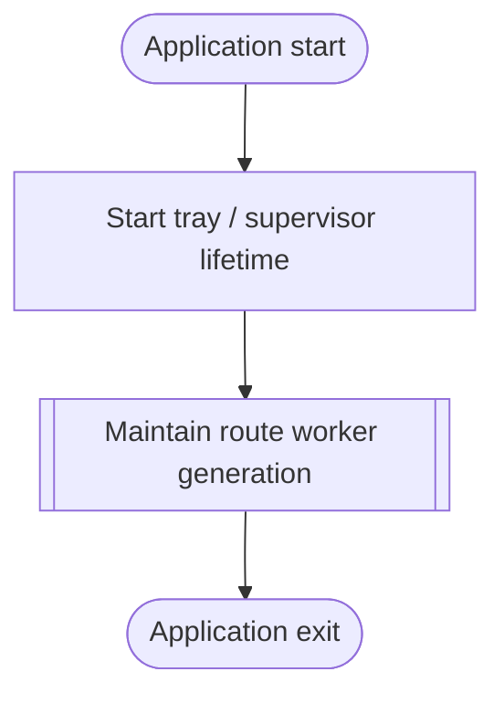

<!--vf:node
schema "vf-kb/0.1"
id "leaudio-router.round4-shell"
kind "module"
coverage "mapped"
-->

<!--vf:summary
entry "Launching LEAudioRouter without explicit CLI arguments starts the Windows tray/supervisor product lifetime."
problem "The product needs a stable user-facing lifetime that continuously expresses routing intent while disposable audio-route generations may be replaced underneath it."
behavior "Keep one tray/supervisor process alive, expose only route category and manual restart controls, and maintain one disposable worker generation through automatic supervision."
exit "The application remains alive with a healthy or recovering worker generation until the user exits the tray application."
-->

<!--vf:source
id "program"
repo "STanJK/le-audio-windows-relay"
rev "16b9ed8ccfc8f369170f84d191ffbcfb4de69b58"
path "Program.cs"
symbol "Program"
-->

<!--vf:source
id "shell"
repo "STanJK/le-audio-windows-relay"
rev "16b9ed8ccfc8f369170f84d191ffbcfb4de69b58"
path "Shell/TrayApplicationContext.cs"
symbol "TrayApplicationContext"
-->

<!--vf:source
id "architecture"
repo "STanJK/le-audio-windows-relay"
rev "16b9ed8ccfc8f369170f84d191ffbcfb4de69b58"
path "docs/ARCHITECTURE.md"
-->

<!--vf:source
id "adr-worker-boundary"
repo "STanJK/le-audio-windows-relay"
rev "16b9ed8ccfc8f369170f84d191ffbcfb4de69b58"
path "docs/decisions/0001-out-of-process-route-generation.md"
-->

<!--vf:claim
id "application-alive-is-routing-intent"
type "fact"
text "Round4 defines application lifetime itself as routing intent and exposes no independent Router Enabled state."
evidence "architecture"
evidence "shell"
-->

<!--vf:claim
id "recovery-is-not-user-configurable"
type "fact"
text "Round4 defines backend recovery as automatic product behavior and exposes no Auto reconnect control."
evidence "architecture"
evidence "shell"
-->

<!--vf:claim
id "worker-process-is-single-isolation-boundary"
type "fact"
text "Round4 permits one tray/supervisor process role and one current Audio Route Worker process role, with no process split for capture, render, timing, or telemetry."
evidence "adr-worker-boundary"
-->

**Why:** Round4 separates the durable product lifetime from disposable route generations without exposing internal lifecycle policy as user configuration. [explain →](./round4-shell.fact.md#root-why)

**What:** The tray process owns user interaction and supervision while one replaceable worker process represents the current route generation. [explain →](./round4-shell.fact.md#root-what)

**Outcome:** While the application remains open, routing is continuously intended and worker failure or replacement remains an internal automatic lifecycle operation. [explain →](./round4-shell.fact.md#root-outcome)



<!--vf:pseudocode
node leaudio-router.round4-shell
flow product-lifetime
audience human
purpose "Linear reading companion to the Mermaid flow; ignored by AI context by default."
-->
```text
ON normal application start:
    create the tray shell
    start the backend supervisor

    WHILE the tray application is alive:
        treat application lifetime as routing intent
        maintain one healthy route worker generation
        automatically replace failed or stale generations

        allow the user to:
            change render category
            request a route restart
            exit the application

    ON Exit:
        stop the current worker generation
        stop supervision
        terminate the tray process
```
<!--vf:end-->
