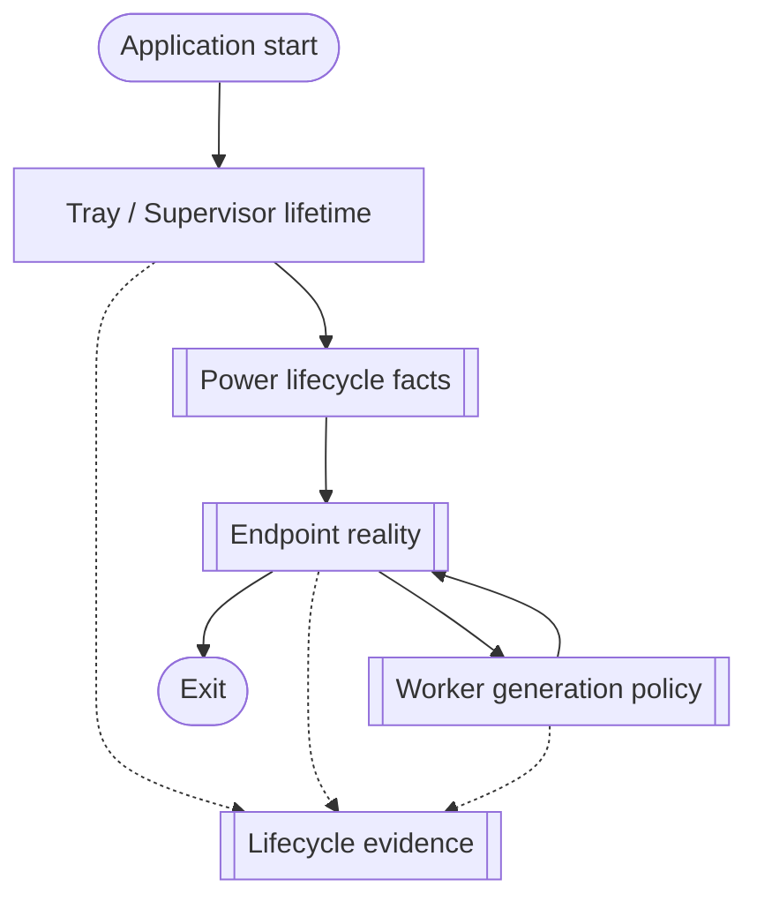

<!--vf:node
schema "vf-kb/0.1"
id "leaudio-router.round4-shell"
kind "module"
coverage "mapped"
-->

<!--vf:summary
entry "Launching LEAudioRelay normally starts the durable Windows tray/supervisor product lifetime."
problem "Routing intent must survive endpoint absence, worker replacement, and Windows power transitions without pushing audio-object ownership into the UI process."
behavior "Keep one tray/supervisor process alive, observe Windows facts, reconcile whether one disposable route generation should exist, and expose only mode, manual restart, and Exit as user controls."
exit "The product remains in a truthful lifecycle state until the user exits; route generations may be created, replaced, or absent underneath it."
-->

<!--vf:source
id "program"
repo "STanJK/LE-Audio-Relay"
rev "da3217f76a0632bdaf6fea25e9103dbef0298137"
path "Program.cs"
symbol "Program"
-->

<!--vf:source
id "shell"
repo "STanJK/LE-Audio-Relay"
rev "da3217f76a0632bdaf6fea25e9103dbef0298137"
path "Shell/TrayApplicationContext.cs"
symbol "TrayApplicationContext"
-->

<!--vf:source
id "supervisor"
repo "STanJK/LE-Audio-Relay"
rev "da3217f76a0632bdaf6fea25e9103dbef0298137"
path "Supervision/BackendSupervisor.cs"
symbol "BackendSupervisor"
-->

<!--vf:source
id "adr-worker"
repo "STanJK/LE-Audio-Relay"
rev "da3217f76a0632bdaf6fea25e9103dbef0298137"
path "docs/decisions/0001-out-of-process-route-generation.md"
-->

<!--vf:source
id "adr-endpoint"
repo "STanJK/LE-Audio-Relay"
rev "da3217f76a0632bdaf6fea25e9103dbef0298137"
path "docs/decisions/0002-event-driven-endpoint-reconciliation.md"
-->

<!--vf:source
id "adr-power"
repo "STanJK/LE-Audio-Relay"
rev "da3217f76a0632bdaf6fea25e9103dbef0298137"
path "docs/decisions/0003-power-revision-route-invalidation.md"
-->

<!--vf:claim
id "application-alive-is-routing-intent"
type "fact"
text "The tray exposes no independent enabled state: while the application is alive, supervision interprets that lifetime as routing intent."
evidence "shell"
-->

<!--vf:claim
id "two-process-roles-only"
type "fact"
text "The accepted runtime model has one Tray/Supervisor process and at most one current Audio Route Worker process; capture, render, timing, telemetry, and lifecycle observation are not separate process roles."
evidence "adr-worker"
-->

<!--vf:claim
id "observation-and-policy-are-separated"
type "fact"
text "Endpoint and power observers report facts or wake-ups; BackendSupervisor owns the policy that creates, replaces, or removes a worker generation."
evidence "supervisor"
evidence "adr-endpoint"
evidence "adr-power"
-->

**Why:** Product lifetime is intentionally more durable than any one audio route generation. [explain →](./round4-shell.fact.md#two-lifetimes-not-one)

**What:** Shell owns interaction, Lifecycle owns observations, Supervision owns route-generation policy, and one worker owns one route generation. [explain →](./round4-shell.fact.md#two-lifetimes-not-one)

**Outcome:** Endpoint loss, reconnect, restart, or resume can replace route state without requiring the user to restart the tray application. [explain →](./round4-shell.fact.md#two-lifetimes-not-one)



<!--vf:pseudocode
node leaudio-router.round4-shell
flow product-lifetime
audience human
purpose "Cross-layer product-lifetime projection; child nodes own detailed lifecycle mechanics."
-->
```text
START tray application

WHILE application is alive:
    observe current power and endpoint facts
    let supervision reconcile whether one worker generation should exist

    IF suspended or target absent or topology blocked:
        allow zero worker generations

    ELSE:
        maintain one eligible healthy generation

    user may change render category, request route restart, or Exit

ON Exit:
    stop the current generation with bounded worker-control semantics
    dispose observers and tray resources
```
<!--vf:end-->
