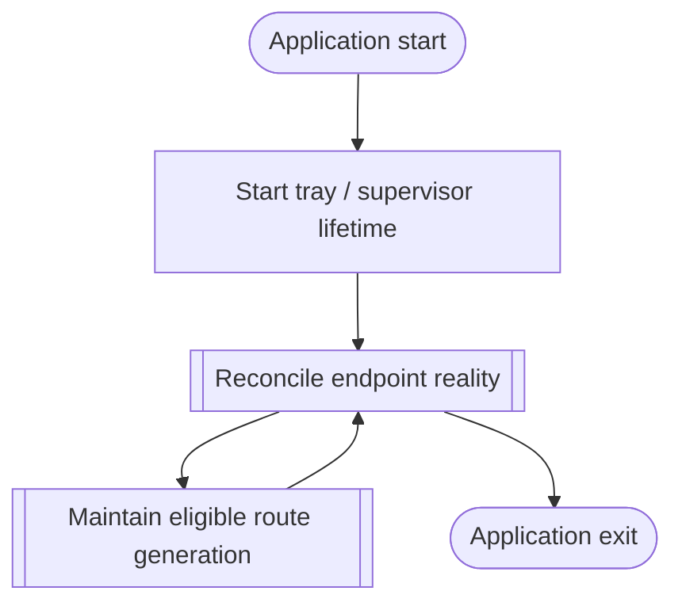

<!--vf:node
schema "vf-kb/0.1"
id "leaudio-router.round4-shell"
kind "module"
coverage "mapped"
-->

<!--vf:summary
entry "Launching LEAudioRouter without explicit CLI arguments starts the Windows tray/supervisor product lifetime."
problem "The product needs a stable user-facing lifetime that continuously expresses routing intent while endpoint availability and disposable audio-route generations change underneath it."
behavior "Keep one tray/supervisor process alive, reconcile Windows endpoint reality from event-driven lifecycle observations, expose only route category and manual restart controls, and maintain one disposable worker generation only when topology is eligible."
exit "The application remains alive in Running, WaitingForEndpoint, TopologyBlocked, or RecoveringFault states until the user exits."
-->

<!--vf:source
id "program"
repo "STanJK/le-audio-windows-relay"
rev "ad97006de6e95db08c2873a11aa2ee97ef5ad532"
path "Program.cs"
symbol "Program"
-->

<!--vf:source
id "shell"
repo "STanJK/le-audio-windows-relay"
rev "ad97006de6e95db08c2873a11aa2ee97ef5ad532"
path "Shell/TrayApplicationContext.cs"
symbol "TrayApplicationContext"
-->

<!--vf:source
id "architecture"
repo "STanJK/le-audio-windows-relay"
rev "ad97006de6e95db08c2873a11aa2ee97ef5ad532"
path "docs/ARCHITECTURE.md"
-->

<!--vf:source
id "adr-worker-boundary"
repo "STanJK/le-audio-windows-relay"
rev "ad97006de6e95db08c2873a11aa2ee97ef5ad532"
path "docs/decisions/0001-out-of-process-route-generation.md"
-->

<!--vf:source
id "adr-endpoint-reconciliation"
repo "STanJK/le-audio-windows-relay"
rev "ad97006de6e95db08c2873a11aa2ee97ef5ad532"
path "docs/decisions/0002-event-driven-endpoint-reconciliation.md"
-->

<!--vf:claim
id "application-alive-is-routing-intent"
type "fact"
text "Round4 defines application lifetime itself as routing intent and exposes no independent Router Enabled state."
evidence "architecture"
evidence "shell"
-->

<!--vf:claim
id "recovery-is-not-user-configurable"
type "fact"
text "Round4 defines recovery as automatic product behavior and exposes no Auto reconnect control."
evidence "architecture"
evidence "shell"
-->

<!--vf:claim
id "worker-process-is-single-isolation-boundary"
type "fact"
text "Round4 permits one tray/supervisor process role and one current Audio Route Worker process role, with no process split for capture, render, timing, telemetry, or lifecycle observation."
evidence "adr-worker-boundary"
-->

<!--vf:claim
id "endpoint-reconciliation-is-event-driven"
type "fact"
text "Round4 uses Core Audio notifications to wake supervision and fresh endpoint enumeration to determine whether a worker should exist."
evidence "adr-endpoint-reconciliation"
evidence "architecture"
-->

**Why:** Round4 separates durable product lifetime, observed Windows reality, and disposable route generations without exposing internal lifecycle policy as user configuration. [explain →](./round4-shell.fact.md#root-why)

**What:** The tray owns user interaction; Lifecycle reports endpoint facts; Supervision decides whether a worker should exist; one worker owns one real audio route generation. [explain →](./round4-shell.fact.md#root-what)

**Outcome:** The application can remain quietly alive while Buds are absent, then start a fresh route generation only after Windows topology becomes eligible again. [explain →](./round4-shell.fact.md#root-outcome)



<!--vf:pseudocode
node leaudio-router.round4-shell
flow product-lifetime
audience human
purpose "Linear reading companion to the Mermaid flow; ignored by AI context by default."
-->
```text
ON normal application start:
    create the tray shell
    start endpoint observation
    start the backend supervisor

    WHILE the tray application is alive:
        treat application lifetime as routing intent
        reconcile current Windows endpoint reality

        IF target endpoint is absent:
            maintain zero route workers
            wait quietly for topology change

        ELSE IF topology is eligible:
            maintain one healthy route worker generation

        IF eligible route generation fails:
            recover automatically with bounded backoff

        allow the user to:
            change render category
            request a route restart
            exit the application

    ON Exit:
        stop the current worker generation
        stop endpoint observation
        stop supervision
        terminate the tray process
```
<!--vf:end-->
