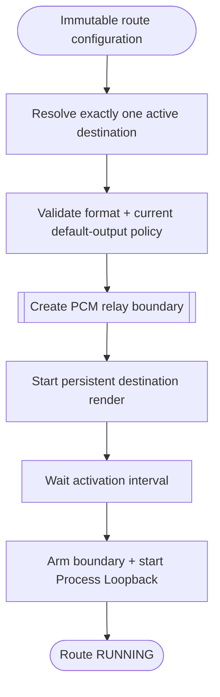

<!--vf:node
schema "vf-kb/0.1"
id "leaudio-router.round4-shell.worker-generation.route-session"
kind "behavior"
parent "leaudio-router.round4-shell.worker-generation"
coverage "mapped"
-->

<!--vf:summary
entry "A backend worker calls RouteSession.StartAsync with one immutable route-generation configuration."
problem "One worker must own the complete Process Loopback-to-LE-render path while target resolution, format policy, startup ordering, and route failure remain explicit."
behavior "Resolve exactly one active destination by the current name match, validate 48 kHz Float32 stereo and default-output safety, construct the PCM boundary, create persistent destination render plus process-scoped loopback capture, start render first, then arm and start capture."
exit "A running route stays worker-owned until shutdown or one normalized route-failure signal completes it."
-->

<!--vf:source
id "route"
repo "STanJK/LE-Audio-Relay"
rev "da3217f76a0632bdaf6fea25e9103dbef0298137"
path "Routing/RouteSession.cs"
symbol "RouteSession"
-->

<!--vf:source
id "resolver"
repo "STanJK/LE-Audio-Relay"
rev "da3217f76a0632bdaf6fea25e9103dbef0298137"
path "Routing/AudioEndpointResolver.cs"
symbol "AudioEndpointResolver"
-->

<!--vf:source
id "capture"
repo "STanJK/LE-Audio-Relay"
rev "da3217f76a0632bdaf6fea25e9103dbef0298137"
path "Routing/ProcessLoopbackSource.cs"
symbol "ProcessLoopbackSource"
-->

<!--vf:source
id "render"
repo "STanJK/LE-Audio-Relay"
rev "da3217f76a0632bdaf6fea25e9103dbef0298137"
path "Routing/PersistentRenderSink.cs"
symbol "PersistentRenderSink"
-->

<!--vf:source
id "format"
repo "STanJK/LE-Audio-Relay"
rev "da3217f76a0632bdaf6fea25e9103dbef0298137"
path "Routing/AudioFormatPolicy.cs"
symbol "AudioFormatPolicy"
-->

<!--vf:source
id "category"
repo "STanJK/LE-Audio-Relay"
rev "da3217f76a0632bdaf6fea25e9103dbef0298137"
path "Routing/RenderCategoryPolicy.cs"
symbol "RenderCategoryPolicy"
-->

<!--vf:claim
id "destination-is-currently-name-resolved"
type "fact"
text "Route startup requires exactly one Active render endpoint whose FriendlyName contains the configured DestinationMatch; the current Daily 2 default is Galaxy Buds3 Pro."
evidence "resolver"
evidence "route"
-->

<!--vf:claim
id "default-output-is-policy-checked-not-capture-bound"
type "fact"
text "Route startup rejects a default multimedia endpoint whose name points to the destination/Galaxy Buds3 Pro or CABLE Input, but Process Loopback itself is process-scoped and is not bound to that sacrificial/default endpoint."
evidence "route"
evidence "capture"
-->

<!--vf:claim
id "destination-starts-before-capture"
type "fact"
text "RouteSession starts persistent destination rendering, waits approximately 250 ms, arms the PCM boundary, and only then starts Process Loopback capture."
evidence "route"
-->

<!--vf:claim
id "route-format-is-strict"
type "fact"
text "The destination MixFormat must be 48 kHz Float32 stereo; the render category is selected from GameEffects, GameMedia, Media, or unset according to RelayMode."
evidence "format"
evidence "category"
-->

<!--vf:claim
id "unexpected-audio-stop-is-one-route-failure"
type "fact"
text "Unexpected render stop, capture stop, or capture packet handling failure completes the RouteSession failure signal consumed by the worker."
evidence "route"
evidence "capture"
evidence "render"
-->

**Why:** The worker needs one owner for all audio objects so a generation can be replaced coherently. [explain →](./round4-shell.fact.md#two-lifetimes-not-one)

**What:** Resolve policy, build one persistent render + process loopback route, and normalize route-local failure. [explain →](./round4-shell.fact.md#two-lifetimes-not-one)

**Outcome:** Worker RUNNING means the real audio path has started, not merely that a child process exists. [explain →](./round4-shell.fact.md#two-lifetimes-not-one)



<!--vf:pseudocode
node leaudio-router.round4-shell.worker-generation.route-session
flow route-startup
audience human
purpose "Worker-local route construction and ownership projection."
-->
```text
resolve exactly one active target matching DestinationMatch
validate target MixFormat = 48 kHz / Float32 / stereo
validate current default multimedia endpoint against the temporary safety heuristic

create telemetry + PCM boundary
create persistent destination render with selected stream category
create Process Loopback capture excluding this worker process tree

start destination render
wait ~250 ms
arm boundary
start capture
return RUNNING RouteSession

ON unexpected render/capture/callback failure:
    signal one RouteFailure

ON dispose:
    disable boundary
    stop capture
    stop render
    dispose route-owned resources
```
<!--vf:end-->
