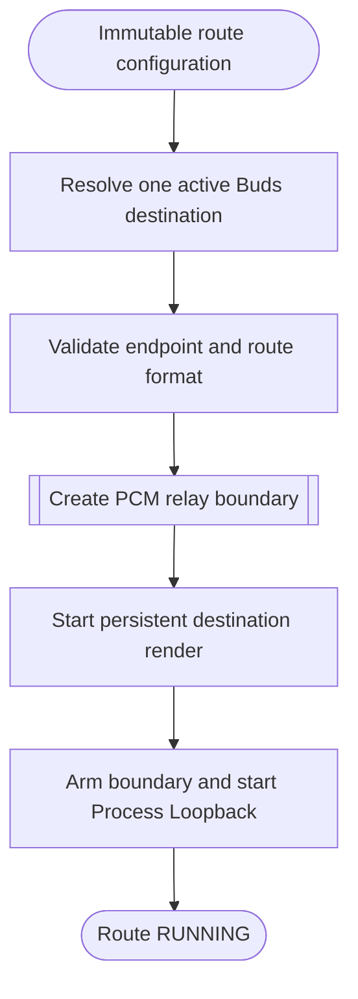

<!--vf:node
schema "vf-kb/0.1"
id "leaudio-router.round4-shell.worker-generation.route-session"
kind "behavior"
parent "leaudio-router.round4-shell.worker-generation"
coverage "mapped"
-->

<!--vf:summary
entry "A backend worker with an immutable route-generation configuration calls RouteSession.StartAsync."
problem "One worker generation must construct and own the complete Process Loopback to Buds audio path while keeping route-local failures observable and disposable."
behavior "Resolve and validate the destination, construct the PCM boundary, create destination render and Process Loopback capture, start destination rendering first, arm the boundary, start capture, and signal unexpected source/render termination as route failure."
exit "A running route remains owned by the worker until shutdown or route failure, after which its capture, render, endpoint, and resolver resources are disposed in order."
-->

<!--vf:source
id "route"
repo "STanJK/le-audio-windows-relay"
rev "16b9ed8ccfc8f369170f84d191ffbcfb4de69b58"
path "Routing/RouteSession.cs"
symbol "RouteSession"
-->

<!--vf:source
id "capture"
repo "STanJK/le-audio-windows-relay"
rev "16b9ed8ccfc8f369170f84d191ffbcfb4de69b58"
path "Routing/ProcessLoopbackSource.cs"
symbol "ProcessLoopbackSource"
-->

<!--vf:source
id "render"
repo "STanJK/le-audio-windows-relay"
rev "16b9ed8ccfc8f369170f84d191ffbcfb4de69b58"
path "Routing/PersistentRenderSink.cs"
symbol "PersistentRenderSink"
-->

<!--vf:source
id "format"
repo "STanJK/le-audio-windows-relay"
rev "16b9ed8ccfc8f369170f84d191ffbcfb4de69b58"
path "Routing/AudioFormatPolicy.cs"
symbol "AudioFormatPolicy"
-->

<!--vf:source
id "category"
repo "STanJK/le-audio-windows-relay"
rev "16b9ed8ccfc8f369170f84d191ffbcfb4de69b58"
path "Routing/RenderCategoryPolicy.cs"
symbol "RenderCategoryPolicy"
-->

<!--vf:claim
id "capture-excludes-worker-tree"
type "fact"
text "The Round4 Process Loopback source captures in ExcludeTargetProcessTree mode for the current worker process."
evidence "capture"
-->

<!--vf:claim
id "destination-starts-first"
type "fact"
text "RouteSession starts the persistent destination render, waits the activation interval, arms the PCM boundary, and only then starts Process Loopback capture."
evidence "route"
-->

<!--vf:claim
id "route-format-is-48k-float-stereo"
type "fact"
text "The route validates the destination MixFormat as 48 kHz Float32 stereo and creates the relay format with the same rate and channel count."
evidence "format"
evidence "route"
-->

<!--vf:claim
id "unexpected-audio-stop-becomes-route-failure"
type "fact"
text "Unexpected render PlaybackStopped, capture RecordingStopped, or capture packet handling exceptions complete the RouteSession failure signal."
evidence "route"
evidence "capture"
evidence "render"
-->

**Why:** The worker needs one explicit owner for the whole audio generation so route-local resources and failures can be discarded together. [explain →](./round4-shell.fact.md#route-why)

**What:** RouteSession builds the validated destination-first Process Loopback route, owns its capture/render/buffer resources, and converts unexpected audio stops into one route failure signal. [explain →](./round4-shell.fact.md#route-what)

**Outcome:** A successful RouteSession provides the worker's real RUNNING state; any later route failure causes that worker generation to be replaced by supervision. [explain →](./round4-shell.fact.md#route-outcome)



<!--vf:pseudocode
node leaudio-router.round4-shell.worker-generation.route-session
flow route-startup
audience human
purpose "Linear reading companion to the Mermaid flow; ignored by AI context by default."
-->
```text
START RouteSession(configuration):
    resolve exactly one active render endpoint matching the destination
    require destination MixFormat = 48 kHz / Float32 / stereo
    reject Buds or CABLE Input as the Windows default render sink

    create worker-local route telemetry
    create the basic PCM relay boundary
    create the persistent destination renderer
    create Process Loopback capture excluding this worker process tree

    subscribe route-local failure signals

    start destination rendering first
    wait for the destination activation interval
    arm the PCM boundary
    start Process Loopback capture

    return RUNNING RouteSession

WHILE running:
    IF render stops unexpectedly:
        signal route failure

    IF capture stops unexpectedly:
        signal route failure

    IF capture packet handling fails:
        signal route failure

ON dispose:
    return boundary to keepalive
    stop capture
    stop render
    dispose route-owned resources
```
<!--vf:end-->
