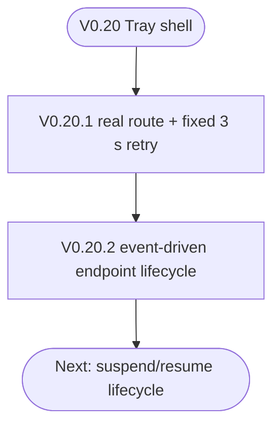

<!--vf:node
schema "vf-kb/0.1"
id "leaudio-router.release.v0-20-2"
kind "module"
coverage "mapped"
-->

<!--vf:summary
entry "V0.20.2 freezes the first real audio-routing Tray build whose endpoint lifecycle is event-driven rather than fixed-retry-driven."
problem "The project needs an evidence-bearing release boundary for the first architecture that cleanly separates physical endpoint absence from genuine route failure."
behavior "Preserve the tested Tray/Supervisor + disposable worker + RouteSession architecture together with Core Audio notification wake-ups, authoritative endpoint re-enumeration, zero-worker waiting during endpoint absence, TopologyBlocked handling, and bounded retry for real route faults."
exit "V0.20.2 serves as the canonical baseline for subsequent suspend/resume and deeper lifecycle work."
-->

<!--vf:source
id "release-note"
repo "STanJK/le-audio-windows-relay"
rev "1c010616d7c82215c92c391ecf22559c3e3c2523"
path "docs/releases/V0.20.2.md"
-->

<!--vf:source
id "architecture"
repo "STanJK/le-audio-windows-relay"
rev "1c010616d7c82215c92c391ecf22559c3e3c2523"
path "docs/ARCHITECTURE.md"
-->

<!--vf:source
id "endpoint-lifecycle"
repo "STanJK/le-audio-windows-relay"
rev "1c010616d7c82215c92c391ecf22559c3e3c2523"
path "VF/endpoint-lifecycle.vf.md"
-->

<!--vf:source
id "route-session"
repo "STanJK/le-audio-windows-relay"
rev "1c010616d7c82215c92c391ecf22559c3e3c2523"
path "VF/route-session.vf.md"
-->

<!--vf:claim
id "v0202-is-event-driven-lifecycle-baseline"
type "fact"
text "V0.20.2 is the first frozen release in which physical endpoint absence enters WaitingForEndpoint with zero workers, while reconnect is triggered by endpoint topology change followed by authoritative re-enumeration."
evidence "release-note"
evidence "endpoint-lifecycle"
-->

<!--vf:claim
id "v0202-preserves-real-route"
type "fact"
text "V0.20.2 includes the real handwritten RouteSession, Process Loopback source, PCM relay boundary, persistent Buds render, and disposable worker generation."
evidence "release-note"
evidence "route-session"
-->

<!--vf:claim
id "v0202-manual-lifecycle-validation"
type "fact"
text "The V0.20.2 release record states that connected startup, disconnect-to-zero-worker, quiet waiting without worker churn, reconnect-to-one-new-generation, mode replacement, TopologyBlocked, and topology recovery were manually validated before release."
evidence "release-note"
-->

**Why:** V0.20.2 marks the point where endpoint lifecycle semantics became explicit, observable, and separable from generic worker failure. [explain →](./v0.20.2.fact.md#why)

**What:** The release freezes the event-driven endpoint observer/probe model together with the already working real audio route and process-generation isolation. [explain →](./v0.20.2.fact.md#what)

**Outcome:** Future suspend/resume and deeper lifecycle work can build from a tested baseline where disconnect/reconnect no longer causes background worker churn. [explain →](./v0.20.2.fact.md#outcome)



<!--vf:pseudocode
node leaudio-router.release.v0-20-2
flow release-lineage
audience human
purpose "Historical release projection for the first event-driven endpoint lifecycle baseline."
-->
```text
V0.20:
    stabilize Tray/Supervisor lifetime

V0.20.1:
    add real RouteSession
    recover every 3 seconds after generic route failure

V0.20.2:
    keep the real RouteSession
    add Core Audio endpoint observation
    use notification only as wake-up
    re-enumerate endpoint reality
    IF target absent:
        keep zero workers
    IF target returns:
        create one fresh generation
    IF topology remains eligible but route fails:
        use bounded fault backoff

NEXT:
    add Windows suspend/resume as another Lifecycle observation
```
<!--vf:end-->
