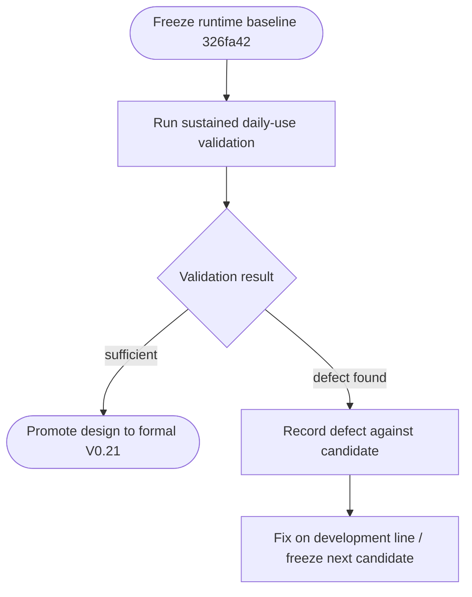

<!--vf:node
schema "vf-kb/0.1"
id "leaudio-router.release.v0-21-daily-test-candidate-1"
kind "module"
coverage "mapped"
-->

<!--vf:summary
entry "V0.21 Daily Test Candidate 1 freezes the first Round4 build intended for sustained ordinary daily use."
problem "Long-run validation needs an immutable evidence-bearing baseline so lifecycle, audio stability, and provisional drift behavior are tested against one exact implementation rather than a moving development branch."
behavior "Freeze runtime baseline 326fa42 with endpoint lifecycle reconciliation, power-revision invalidation, lifecycle-only persistent logging, real Process Loopback routing, and the provisional 10 ms-centered positive-drift guard; mark all full-daily-validation conclusions as pending."
exit "The candidate remains frozen while daily-use evidence accumulates; successful validation may promote its design into formal V0.21, while failures must produce a new development fix/candidate rather than rewriting this baseline."
-->

<!--vf:source
id "release-note"
repo "STanJK/le-audio-windows-relay"
rev "b74aa43963fa9291c4058b2cba00d2d4643c44b7"
path "docs/releases/V0.21-daily-test-candidate-1.md"
-->

<!--vf:source
id "architecture"
repo "STanJK/le-audio-windows-relay"
rev "326fa42cf2a6069c97ab11c9a60e635b4481c1c0"
path "docs/ARCHITECTURE.md"
-->

<!--vf:source
id "power-lifecycle"
repo "STanJK/le-audio-windows-relay"
rev "326fa42cf2a6069c97ab11c9a60e635b4481c1c0"
path "VF/power-lifecycle.vf.md"
-->

<!--vf:source
id "endpoint-lifecycle"
repo "STanJK/le-audio-windows-relay"
rev "326fa42cf2a6069c97ab11c9a60e635b4481c1c0"
path "VF/endpoint-lifecycle.vf.md"
-->

<!--vf:source
id "lifecycle-journal"
repo "STanJK/le-audio-windows-relay"
rev "326fa42cf2a6069c97ab11c9a60e635b4481c1c0"
path "VF/lifecycle-journal.vf.md"
-->

<!--vf:source
id "drift-guard"
repo "STanJK/le-audio-windows-relay"
rev "326fa42cf2a6069c97ab11c9a60e635b4481c1c0"
path "VF/provisional-positive-drift-guard.vf.md"
-->

<!--vf:claim
id "candidate-is-frozen"
type "fact"
text "V0.21 Daily Test Candidate 1 freezes runtime implementation baseline 326fa42 for full daily-use validation."
evidence "release-note"
-->

<!--vf:claim
id "candidate-is-not-stable-release"
type "fact"
text "The release record explicitly marks this candidate as full validation in progress and not yet a stable/public release."
evidence "release-note"
-->

<!--vf:claim
id "candidate-includes-daily-lifecycle-foundation"
type "fact"
text "The frozen candidate includes endpoint reconciliation, power-revision route invalidation, lifecycle-only persistent logging, the real audio route, and the provisional positive-drift guard."
evidence "release-note"
evidence "power-lifecycle"
evidence "endpoint-lifecycle"
evidence "lifecycle-journal"
evidence "drift-guard"
-->

<!--vf:claim
id "long-run-stability-remains-open"
type "assumption"
text "Multi-hour and multi-day stability, repeated suspend/resume robustness, subjective drift-correction transparency, and recurrence of the historical micro-crackle failure remain open validation questions for this candidate."
evidence "release-note"
-->

**Why:** Daily testing only produces useful evidence if the implementation under test is immutable and its unverified claims remain explicitly marked as unverified. [explain →](./v0.21-daily-test-candidate-1.fact.md#why)

**What:** The candidate freezes the complete current daily-use architecture but records its long-run validation status as pending rather than promoting it directly to stable V0.21. [explain →](./v0.21-daily-test-candidate-1.fact.md#what)

**Outcome:** Future observations can be attributed to one exact baseline; successful validation can justify formal V0.21, while discovered regressions remain preserved as evidence rather than erased from history. [explain →](./v0.21-daily-test-candidate-1.fact.md#outcome)



<!--vf:pseudocode
node leaudio-router.release.v0-21-daily-test-candidate-1
flow candidate-validation
audience human
purpose "Release-validation projection for the frozen daily-use candidate."
-->
```text
FREEZE:
    runtime implementation = 326fa42
    candidate identity = V0.21 Daily Test Candidate 1
    status = full daily-use validation in progress

TEST WITHOUT MUTATING THIS BASELINE:
    repeated endpoint disconnect/reconnect
    repeated Windows suspend/resume
    multi-hour continuous audio
    multi-day accumulated lifecycle activity
    lifecycle log quality
    provisional drift correction audibility
    historical micro-crackle recurrence

IF validation is sufficient:
    create formal V0.21 from an explicitly selected validated baseline

IF a defect is found:
    preserve this candidate unchanged
    fix on round4/shell-bootstrap
    freeze a new candidate if another full validation round is required
```
<!--vf:end-->
