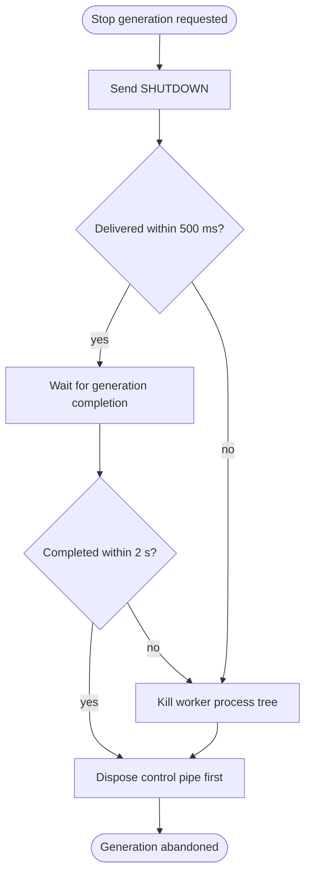

<!--vf:node
schema "vf-kb/0.1"
id "leaudio-router.round4-shell.worker-generation.worker-control-liveness"
kind "behavior"
parent "leaudio-router.round4-shell.worker-generation"
coverage "mapped"
-->

<!--vf:summary
entry "Supervision must stop a worker because topology changed, the generation became stale, the app is exiting, or the worker/control channel is unhealthy."
problem "A disposable worker is not a fault boundary if a blocked shutdown IPC write or worker teardown can hold the supervisor reconciliation loop indefinitely."
behavior "Treat SHUTDOWN as a bounded courtesy request: allow at most 500 ms for the pipe write, at most 2 s for graceful completion after delivery, otherwise kill the worker process tree; during cleanup, dispose the pipe before reader/writer/process wrappers."
exit "Supervisor progress is bounded independently of worker cooperation."
-->

<!--vf:source
id "supervisor"
repo "STanJK/LE-Audio-Relay"
rev "da3217f76a0632bdaf6fea25e9103dbef0298137"
path "Supervision/BackendSupervisor.cs"
symbol "BackendSupervisor.StopGenerationAsync"
-->

<!--vf:source
id "generation"
repo "STanJK/LE-Audio-Relay"
rev "da3217f76a0632bdaf6fea25e9103dbef0298137"
path "Supervision/BackendSupervisor.cs"
symbol "BackendSupervisor.WorkerGeneration"
-->

<!--vf:source
id "worker"
repo "STanJK/LE-Audio-Relay"
rev "da3217f76a0632bdaf6fea25e9103dbef0298137"
path "Host/BackendWorker.cs"
symbol "BackendWorker"
-->

<!--vf:claim
id "shutdown-write-is-bounded"
type "fact"
text "StopGenerationAsync waits at most 500 ms for the SHUTDOWN pipe write; failure or timeout skips graceful waiting and proceeds to process kill."
evidence "supervisor"
-->

<!--vf:claim
id "graceful-exit-is-bounded"
type "fact"
text "After SHUTDOWN is delivered, supervision waits at most 2 seconds for generation completion before killing the worker process tree."
evidence "supervisor"
-->

<!--vf:claim
id "worker-cooperation-is-not-required"
type "fact"
text "The supervisor calls Process.Kill(entireProcessTree: true) when bounded graceful shutdown fails, so recovery authority remains outside the worker."
evidence "supervisor"
-->

<!--vf:claim
id "cleanup-breaks-transport-first"
type "fact"
text "WorkerGeneration disposal closes the named pipe before disposing reader, writer, and Process wrappers, breaking outstanding control I/O first."
evidence "generation"
-->

**Why:** A worker process boundary only provides liveness value if the supervisor can always abandon an uncooperative generation. [explain →](./round4-shell.fact.md#worker-liveness-is-an-architectural-invariant)

**What:** Bound both the shutdown command and graceful-exit phases, then make forced process termination authoritative. [explain →](./round4-shell.fact.md#worker-liveness-is-an-architectural-invariant)

**Outcome:** Abrupt endpoint removal or broken worker IPC cannot permanently pin the supervisor in Running/RestartRequested while the tray UI remains alive. [explain →](./round4-shell.fact.md#worker-liveness-is-an-architectural-invariant)



<!--vf:pseudocode
node leaudio-router.round4-shell.worker-generation.worker-control-liveness
flow bounded-stop
audience human
purpose "Linear reading companion to the Mermaid flow; ignored by AI context by default."
-->
```text
TRY send SHUTDOWN
    deadline = 500 ms

IF command delivered:
    wait for generation completion
    deadline = 2 s

IF command delivery failed OR graceful completion timed out:
    kill worker process tree

IF process still exists:
    kill again best-effort

dispose named pipe first
dispose writer / reader / process wrappers best-effort
return control to supervisor
```
<!--vf:end-->
