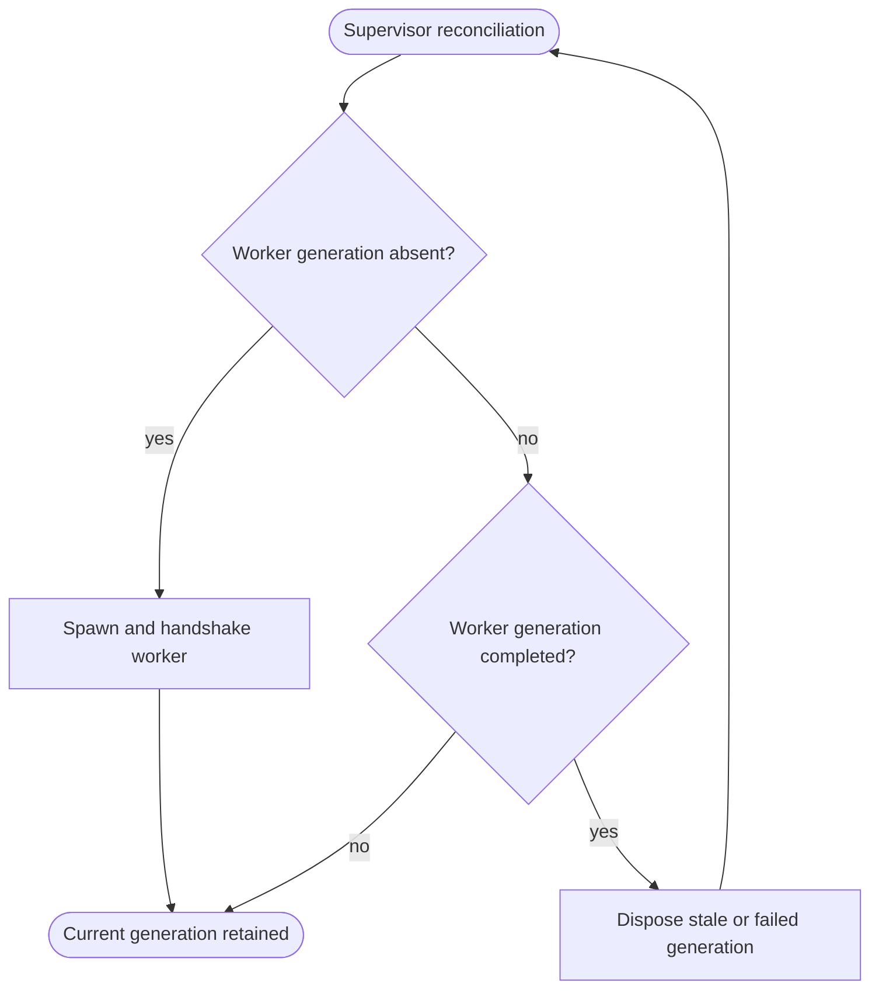

<!--vf:node
schema "vf-kb/0.1"
id "leaudio-router.round4-shell.worker-generation"
kind "behavior"
parent "leaudio-router.round4-shell"
coverage "mapped"
-->

<!--vf:summary
entry "BackendSupervisor starts or reconciles one worker generation using the current immutable route-generation configuration snapshot."
problem "Route-local failures and process-local COM/interop state must be replaceable without terminating the tray product lifetime."
behavior "Spawn one backend-worker process, validate its named-pipe handshake, monitor heartbeat/status, and replace the generation after restart intent, configuration change, worker completion, or heartbeat failure."
exit "A healthy worker remains current, or the failed/stale generation is disposed and supervision proceeds toward a fresh generation."
-->

<!--vf:source
id "supervisor"
repo "STanJK/le-audio-windows-relay"
rev "1ad69da40acdc6ca1f521976a4d123e6e64b0242"
path "Supervision/BackendSupervisor.cs"
symbol "BackendSupervisor"
-->

<!--vf:source
id "worker"
repo "STanJK/le-audio-windows-relay"
rev "1ad69da40acdc6ca1f521976a4d123e6e64b0242"
path "Host/BackendWorker.cs"
symbol "BackendWorker"
-->

<!--vf:source
id "protocol"
repo "STanJK/le-audio-windows-relay"
rev "1ad69da40acdc6ca1f521976a4d123e6e64b0242"
path "Supervision/WorkerProtocol.cs"
symbol "WorkerProtocol"
-->

<!--vf:source
id "generation-config"
repo "STanJK/le-audio-windows-relay"
rev "1ad69da40acdc6ca1f521976a4d123e6e64b0242"
path "Settings/RouteGenerationConfiguration.cs"
symbol "RouteGenerationConfiguration"
-->

<!--vf:source
id "adr"
repo "STanJK/le-audio-windows-relay"
rev "1ad69da40acdc6ca1f521976a4d123e6e64b0242"
path "docs/decisions/0001-out-of-process-route-generation.md"
-->

<!--vf:claim
id "one-worker-is-one-generation"
type "fact"
text "BackendSupervisor assigns a monotonically increasing generation number and spawns one --backend-worker process for that generation."
evidence "supervisor"
-->

<!--vf:claim
id "worker-health-is-observed-by-heartbeat"
type "fact"
text "The supervisor treats worker heartbeat timeout, control-pipe closure, reported fault, or process exit as completion/failure evidence for the current generation."
evidence "supervisor"
evidence "protocol"
-->

<!--vf:claim
id "process-boundary-is-diagnostic"
type "fact"
text "ADR 0001 defines the worker process as a user-mode fault and diagnostic boundary rather than an audio-domain or kernel-fault boundary."
evidence "adr"
-->

**Why:** The worker boundary provides a complete disposable unit for route-local state and a useful diagnostic distinction between process-local failures and faults that survive a fresh PID. [explain →](./round4-shell.fact.md#worker-why)

**What:** The supervisor creates one worker generation, validates its handshake, monitors heartbeats, and replaces it whenever the generation becomes stale or fails. [explain →](./round4-shell.fact.md#worker-what)

**Outcome:** The tray process survives worker replacement while each new route generation receives a fresh worker process and immutable configuration snapshot. [explain →](./round4-shell.fact.md#worker-outcome)



<!--vf:pseudocode
node leaudio-router.round4-shell.worker-generation
flow worker-generation
audience human
purpose "Linear reading companion to the Mermaid flow; ignored by AI context by default."
-->
```text
SUPERVISOR LOOP:
    snapshot current route configuration and restart revision

    IF current generation has completed or failed:
        collect its completion reason
        dispose its process and control resources
        clear current generation
        continue toward automatic replacement

    IF current generation uses stale configuration
       OR predates a manual restart request:
        stop and dispose it
        clear current generation

    IF no current generation exists:
        allocate next generation number
        create private named pipe
        spawn this executable in --backend-worker mode
        require a valid HELLO for this generation
        start heartbeat/status monitoring
        publish RUNNING

    otherwise keep the current generation

WORKER:
    connect to the supplied pipe
    send HELLO and RUNNING
    send periodic HEARTBEAT messages

    ON SHUTDOWN:
        stop heartbeat
        report STOPPING
        exit the process
```
<!--vf:end-->
