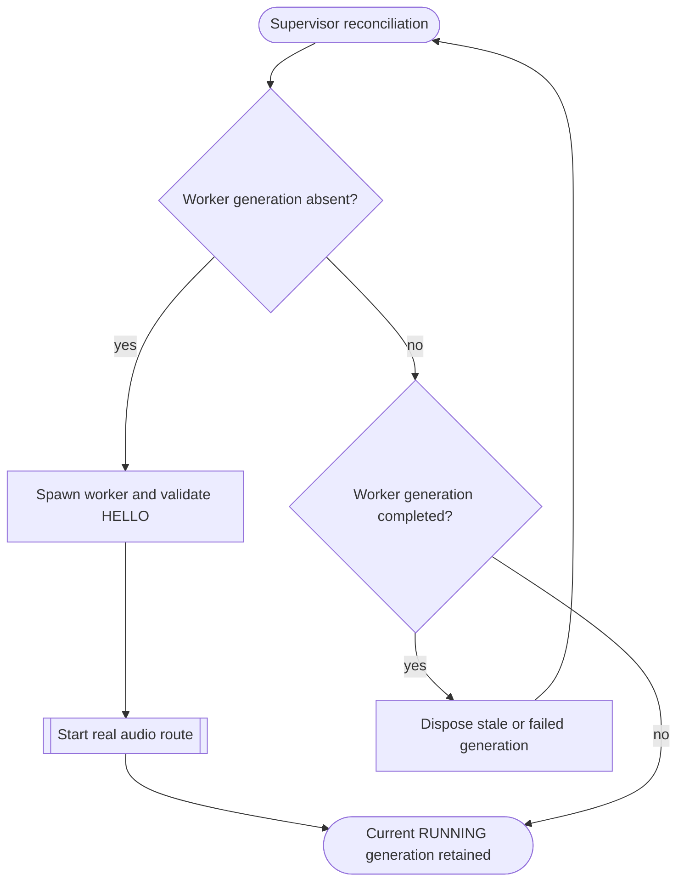

<!--vf:node
schema "vf-kb/0.1"
id "leaudio-router.round4-shell.worker-generation"
kind "behavior"
parent "leaudio-router.round4-shell"
coverage "mapped"
-->

<!--vf:summary
entry "After endpoint lifecycle reconciliation reports eligible topology, BackendSupervisor starts or reconciles one worker generation using the current immutable route-generation configuration snapshot."
problem "Route-local audio state must be replaceable as one process-local unit without terminating the tray product lifetime."
behavior "Only on eligible topology, spawn one backend-worker process, validate HELLO, require the real audio route to reach RUNNING, monitor heartbeat/status, and replace stale or failed generations. Physical endpoint absence is handled by the sibling endpoint-lifecycle behavior rather than worker retry."
exit "A healthy route worker remains current, or the failed/stale generation is disposed and supervision proceeds toward a fresh generation."
-->

<!--vf:source
id "supervisor"
repo "STanJK/le-audio-windows-relay"
rev "ad97006de6e95db08c2873a11aa2ee97ef5ad532"
path "Supervision/BackendSupervisor.cs"
symbol "BackendSupervisor"
-->

<!--vf:source
id "worker"
repo "STanJK/le-audio-windows-relay"
rev "ad97006de6e95db08c2873a11aa2ee97ef5ad532"
path "Host/BackendWorker.cs"
symbol "BackendWorker"
-->

<!--vf:source
id "protocol"
repo "STanJK/le-audio-windows-relay"
rev "ad97006de6e95db08c2873a11aa2ee97ef5ad532"
path "Supervision/WorkerProtocol.cs"
symbol "WorkerProtocol"
-->

<!--vf:source
id "generation-config"
repo "STanJK/le-audio-windows-relay"
rev "ad97006de6e95db08c2873a11aa2ee97ef5ad532"
path "Settings/RouteGenerationConfiguration.cs"
symbol "RouteGenerationConfiguration"
-->

<!--vf:source
id "adr"
repo "STanJK/le-audio-windows-relay"
rev "ad97006de6e95db08c2873a11aa2ee97ef5ad532"
path "docs/decisions/0001-out-of-process-route-generation.md"
-->

<!--vf:claim
id "one-worker-is-one-generation"
type "fact"
text "BackendSupervisor assigns a monotonically increasing generation number and spawns one --backend-worker process for that generation."
evidence "supervisor"
-->

<!--vf:claim
id "running-requires-real-route-start"
type "fact"
text "The supervisor does not publish Running until the worker sends RUNNING, and the worker sends RUNNING only after RouteSession.StartAsync succeeds."
evidence "supervisor"
evidence "worker"
-->

<!--vf:claim
id "worker-health-is-observed-by-heartbeat"
type "fact"
text "The supervisor treats worker heartbeat timeout, control-pipe closure, reported fault, or process exit as completion/failure evidence for the current generation."
evidence "supervisor"
evidence "protocol"
-->

<!--vf:claim
id "process-boundary-is-diagnostic"
type "fact"
text "ADR 0001 defines the worker process as a user-mode fault and diagnostic boundary rather than an audio-domain or kernel-fault boundary."
evidence "adr"
-->

**Why:** The worker boundary provides a complete disposable unit for route-local state and a diagnostic distinction between process-local failures and faults that survive a fresh PID. [explain →](./round4-shell.fact.md#worker-why)

**What:** The supervisor creates one worker generation, validates its control handshake, waits for the contained audio route to become RUNNING, then monitors the worker until replacement is required. [explain →](./round4-shell.fact.md#worker-what)

**Outcome:** The tray process survives worker replacement while each new route generation receives a fresh worker process, immutable configuration snapshot, and freshly constructed audio route. [explain →](./round4-shell.fact.md#worker-outcome)



<!--vf:pseudocode
node leaudio-router.round4-shell.worker-generation
flow worker-generation
audience human
purpose "Linear reading companion to the Mermaid flow; ignored by AI context by default."
-->
```text
SUPERVISOR LOOP:
    snapshot current route configuration and restart revision

    IF current generation completed or failed:
        dispose it
        clear current generation
        return failure to endpoint-aware reconciliation
        retry only if current topology is still eligible

    IF current generation uses stale configuration
       OR predates a manual restart request:
        stop and dispose it
        clear current generation

    IF no current generation exists:
        allocate next generation number
        create private named pipe
        spawn this executable in --backend-worker mode
        require HELLO
        require the worker's real RouteSession to reach RUNNING
        start heartbeat/status monitoring
        publish RUNNING

WORKER:
    connect to parent
    send HELLO
    start RouteSession

    IF RouteSession starts:
        send RUNNING
        send periodic HEARTBEAT messages

    IF RouteSession fails:
        send FAULTED
        exit this generation
```
<!--vf:end-->
