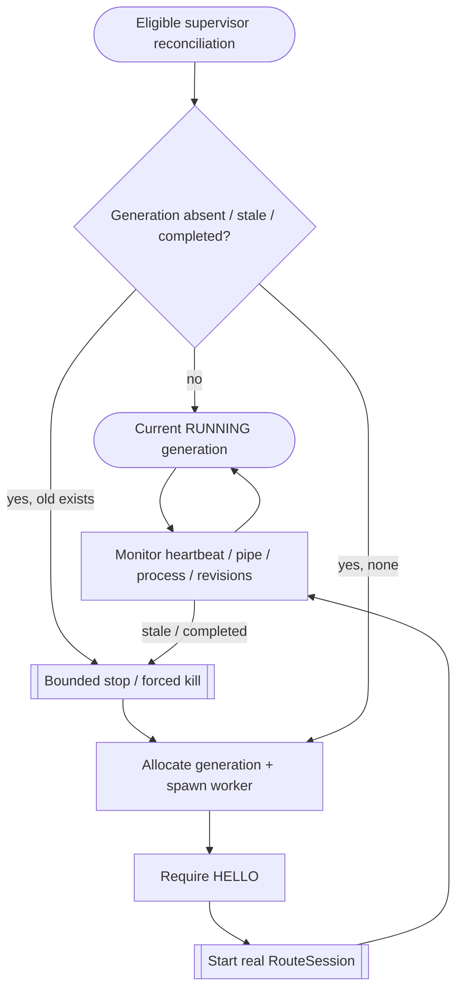

<!--vf:node
schema "vf-kb/0.1"
id "leaudio-router.round4-shell.worker-generation"
kind "behavior"
parent "leaudio-router.round4-shell"
coverage "mapped"
-->

<!--vf:summary
entry "Endpoint and power reconciliation report eligible reality and BackendSupervisor evaluates the desired immutable route-generation snapshot."
problem "All route-local audio state must be replaceable as one process-local unit while the tray lifetime stays alive."
behavior "Spawn at most one backend-worker generation, require HELLO and real route RUNNING, monitor typed status/heartbeat/process completion, and replace a generation when configuration, restart revision, power revision, or health evidence makes it stale."
exit "One healthy current generation remains, or the old generation is boundedly stopped and supervision proceeds toward another eligible generation."
-->

<!--vf:source
id "supervisor"
repo "STanJK/LE-Audio-Relay"
rev "da3217f76a0632bdaf6fea25e9103dbef0298137"
path "Supervision/BackendSupervisor.cs"
symbol "BackendSupervisor"
-->

<!--vf:source
id "worker"
repo "STanJK/LE-Audio-Relay"
rev "da3217f76a0632bdaf6fea25e9103dbef0298137"
path "Host/BackendWorker.cs"
symbol "BackendWorker"
-->

<!--vf:source
id "protocol"
repo "STanJK/LE-Audio-Relay"
rev "da3217f76a0632bdaf6fea25e9103dbef0298137"
path "Supervision/WorkerProtocol.cs"
symbol "WorkerProtocol"
-->

<!--vf:source
id "config"
repo "STanJK/LE-Audio-Relay"
rev "da3217f76a0632bdaf6fea25e9103dbef0298137"
path "Settings/RouteGenerationConfiguration.cs"
symbol "RouteGenerationConfiguration"
-->

<!--vf:source
id "adr"
repo "STanJK/LE-Audio-Relay"
rev "da3217f76a0632bdaf6fea25e9103dbef0298137"
path "docs/decisions/0001-out-of-process-route-generation.md"
-->

<!--vf:claim
id "one-worker-is-one-generation"
type "fact"
text "BackendSupervisor assigns a monotonically increasing generation number and spawns the same executable in --backend-worker mode for at most one current route generation."
evidence "supervisor"
-->

<!--vf:claim
id "running-is-gated-by-real-route-start"
type "fact"
text "The supervisor publishes Running only after the worker sends RUNNING, and the worker sends RUNNING only after RouteSession.StartAsync succeeds."
evidence "supervisor"
evidence "worker"
-->

<!--vf:claim
id "health-evidence-completes-generation"
type "fact"
text "Process exit, control-pipe closure, worker FAULTED/STOPPED messages, or heartbeat timeout complete the current generation monitor."
evidence "supervisor"
evidence "protocol"
-->

<!--vf:claim
id "staleness-is-revisioned"
type "fact"
text "A current generation is replaced when its power revision, restart revision, or immutable route configuration no longer matches the desired snapshot."
evidence "supervisor"
-->

**Why:** The worker is a disposable user-mode fault/diagnostic boundary, not a second product or an audio microservice topology. [explain →](./round4-shell.fact.md#two-lifetimes-not-one)

**What:** Start one real route generation, prove it reached RUNNING, monitor it, and replace it when stale or failed. [explain →](./round4-shell.fact.md#two-lifetimes-not-one)

**Outcome:** The tray survives route replacement and each generation receives fresh process-local threads, handles, COM/WASAPI objects, and managed state. [explain →](./round4-shell.fact.md#two-lifetimes-not-one)



<!--vf:pseudocode
node leaudio-router.round4-shell.worker-generation
flow worker-generation
audience human
purpose "Linear reading companion to the Mermaid flow; ignored by AI context by default."
-->
```text
IF topology is eligible:
    snapshot route configuration + restart revision + power revision

    IF current generation is stale or completed:
        stop it through bounded worker-control-liveness
        clear current generation

    IF no generation exists:
        allocate generation N
        create private named pipe
        spawn --backend-worker
        require HELLO
        require contained RouteSession to reach RUNNING
        start generation monitor

    retain the generation until health or revision evidence invalidates it
```
<!--vf:end-->
