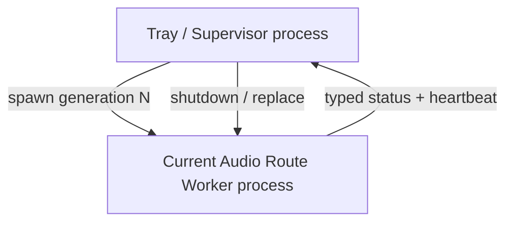

# LE Audio Router — Architecture

Status: **Round4 active architecture**

## Product semantics

The user starts LE Audio Router because they want routing to run.

Therefore:

- **application alive implies routing intent;**
- backend recovery is automatic and silent;
- there is no independent "Router Enabled" state;
- there is no user-configurable "Auto reconnect" policy;
- stopping the product means exiting the application;
- a manual **Restart audio route** command exists as an explicit recovery/debug action.

The small user-facing configuration surface is currently:

- render category: GameEffects, GameMedia, Media, or Default/unset;
- destination match;
- manual route restart;
- application exit.

## Runtime process model

LE Audio Router intentionally uses exactly two runtime process roles:



The worker process is a **user-mode fault and diagnostic boundary**. It is not a separate product and not a general-purpose service.

One worker process represents one disposable audio route generation.

A configuration change, manual restart, worker fault, heartbeat loss, or later route invalidation replaces the entire generation.

## What the process boundary protects

A fresh worker generation gives the route a fresh:

- CLR execution context for the worker;
- set of managed route objects;
- COM/WASAPI objects and handles;
- worker threads and callback state;
- process-local native/interop state.

This provides containment for failures such as:

- unhandled worker exceptions;
- route-local hangs detectable by heartbeat loss;
- process-local COM/interop corruption;
- native user-mode failures that terminate only the worker process.

It also creates a useful diagnostic experiment: if a fresh worker PID clears a fault, process-local state is implicated; if the fault survives a fresh worker PID, evidence points below the worker boundary.

## What the process boundary does not protect

It does **not** protect against:

- Windows kernel bugchecks;
- kernel-mode audio/Bluetooth driver crashes that take down the OS;
- persistent state in Windows Audio services, the Bluetooth host stack, controller firmware, or the earbuds;
- system-wide resource exhaustion.

The architecture must not claim that a child process isolates kernel or hardware faults.

## Constraint: no process microservice expansion

The process boundary occurs once.

Allowed runtime roles:

1. Tray / Supervisor process.
2. Current Audio Route Worker process.

Capture, rendering, timing, telemetry, and route-local coordination remain ordinary modules/threads inside the worker. They must not become separate processes without a new architecture decision backed by evidence.

## Recovery semantics

```text
WHILE the application is alive:
    maintain one healthy route generation

    IF configuration changes:
        replace the current generation

    IF the user requests Restart audio route:
        replace the current generation

    IF the worker exits, faults, or stops heartbeating:
        replace the current generation automatically

ON application exit:
    stop the current generation
    terminate supervision
    exit the tray process
```

Endpoint absence and Windows suspend/resume will be added as lifecycle observations. They will affect whether a worker should currently exist, but automatic recovery remains product behavior rather than a user preference.
