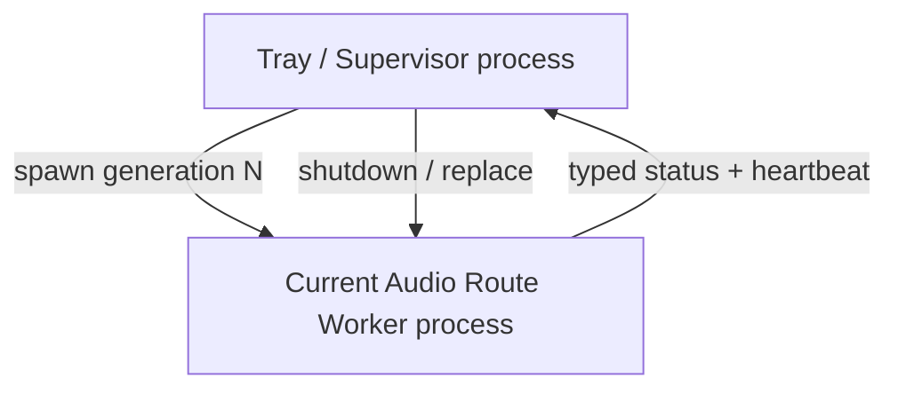
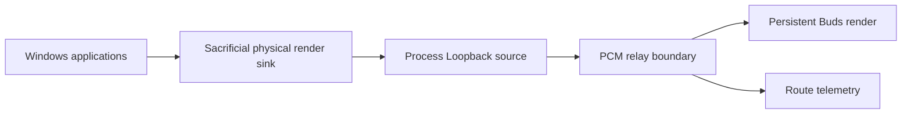

# LE Audio Router — Architecture

Status: **Round4 active architecture**

## Product semantics

The user starts LE Audio Router because they want routing to run.

Therefore:

- **application alive implies routing intent;**
- backend recovery is automatic and silent;
- there is no independent "Router Enabled" state;
- there is no user-configurable "Auto reconnect" policy;
- stopping the product means exiting the application;
- a manual **Restart audio route** command exists as an explicit recovery/debug action.

The user-facing configuration surface is currently:

- render category: GameEffects, GameMedia, Media, or Default/unset;
- manual route restart;
- application exit.

## Runtime process model

LE Audio Router intentionally uses exactly two runtime process roles:



The worker process is a **user-mode fault and diagnostic boundary**. It is not a separate product and not a general-purpose service.

One worker process represents one disposable audio route generation.

## Worker-local audio architecture

The first handwritten Round4 audio route now lives entirely inside the worker:



The route currently owns:

- exactly one active destination endpoint matching the configured Buds name;
- 48 kHz / Float32 / stereo format validation;
- Process Loopback capture excluding the worker process tree;
- destination-first startup;
- one SPSC PCM ring;
- startup cushion gating;
- real-zero destination keepalive;
- route-local stop/fault detection through NAudio PlaybackStopped / RecordingStopped;
- separate telemetry counters for runtime dropped audio frames and runtime dropped silent frames.

The supervisor does not become Running until the worker has sent both HELLO and RUNNING, and RUNNING is sent only after the route has started.

## Timing boundary

The current timing layer is deliberately minimal.

It preserves the existing validated buffer behavior but does not attempt active clock synchronization.

Current behavior:

```text
KEEPALIVE
    ↓ Arm
ARMED
    ↓ current render request + target cushion available
RELAY
```

Deferred behavior:

- drift estimation;
- low/high-water recentering;
- silence-aware correction;
- sample slip / crossfade;
- PLL / ASRC.

Those remain a later Timing control layer so lifecycle/routing changes can be tested independently first.

## What the process boundary protects

A fresh worker generation gives the route a fresh:

- CLR execution context for the worker;
- set of managed route objects;
- COM/WASAPI objects and handles;
- worker threads and callback state;
- process-local native/interop state.

It also creates a diagnostic experiment: if a fresh worker PID clears a fault, process-local state is implicated; if the fault survives a fresh worker PID, evidence points below the worker boundary.

## What the process boundary does not protect

It does **not** protect against:

- Windows kernel bugchecks;
- kernel-mode audio/Bluetooth driver crashes that take down the OS;
- persistent state in Windows Audio services, the Bluetooth host stack, controller firmware, or the earbuds;
- system-wide resource exhaustion.

## Constraint: no process microservice expansion

Allowed runtime roles remain:

1. Tray / Supervisor process.
2. Current Audio Route Worker process.

Capture, rendering, timing, telemetry, and route-local coordination remain ordinary modules/threads inside the worker.

## Recovery semantics

```text
WHILE the application is alive:
    maintain one healthy route generation

    IF configuration changes:
        replace the current generation

    IF the user requests Restart audio route:
        replace the current generation

    IF the worker exits, faults, loses route health, or stops heartbeating:
        replace the current generation automatically

ON application exit:
    stop the current generation
    terminate supervision
    exit the tray process
```

Endpoint absence and Windows suspend/resume will be added as lifecycle observations. Until then, failed route startup is retried with a short recovery delay rather than a tight spawn loop.
