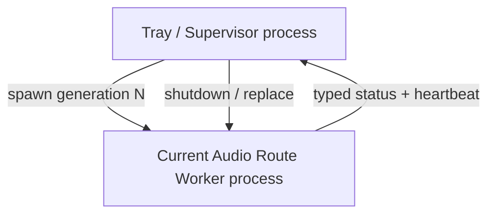
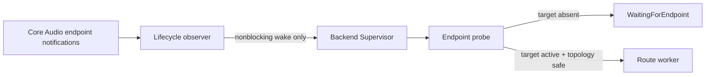
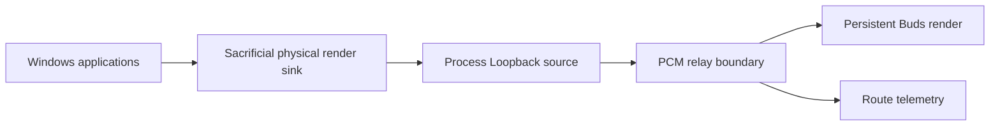

# LE Audio Router — Architecture

Status: **Round4 active architecture**

## Product semantics

The user starts LE Audio Router because they want routing to run.

Therefore:

- **application alive implies routing intent;**
- backend recovery is automatic and silent;
- there is no independent "Router Enabled" state;
- there is no user-configurable "Auto reconnect" policy;
- stopping the product means exiting the application;
- a manual **Restart audio route** command exists as an explicit recovery/debug action.

The user-facing configuration surface is currently:

- render category: GameEffects, GameMedia, Media, or Default/unset;
- manual route restart;
- application exit.

## Runtime process model

LE Audio Router intentionally uses exactly two runtime process roles:



The worker process is a **user-mode fault and diagnostic boundary**. It is not a separate product and not a general-purpose service.

One worker process represents one disposable audio route generation.

## Event-driven endpoint lifecycle

Worker existence is reconciled against observed Windows endpoint reality rather than maintained by a fixed retry loop.



The notification callback is deliberately not authoritative. It only wakes supervision.

The supervisor then re-enumerates current active render endpoints and the current default multimedia render endpoint. Re-enumeration is the source of truth because reconnects may generate multiple notifications and endpoint IDs/states may change during topology reconstruction.

### Endpoint states

```text
target absent
    => WaitingForEndpoint
    => zero worker processes
    => no route startup retries

target ambiguous or default render unsafe
    => TopologyBlocked
    => zero worker processes

target active + default render safe
    => one worker should exist

worker/route failure while target remains active
    => RecoveringFault
    => bounded backoff: 1s, 2s, 5s, 10s, 30s
```

A 30-second low-frequency topology safety probe exists only as protection against a missed Core Audio notification. It does not create a worker while the endpoint is still absent.

## Worker-local audio architecture

The handwritten Round4 audio route lives entirely inside the worker:



The route currently owns:

- exactly one active destination endpoint matching the configured Buds name;
- 48 kHz / Float32 / stereo format validation;
- Process Loopback capture excluding the worker process tree;
- destination-first startup;
- one SPSC PCM ring;
- startup cushion gating;
- real-zero destination keepalive;
- route-local stop/fault detection through NAudio PlaybackStopped / RecordingStopped;
- separate telemetry counters for runtime dropped audio frames and runtime dropped silent frames.

The supervisor does not become Running until the worker has sent both HELLO and RUNNING, and RUNNING is sent only after the route has started.

## Timing boundary

The current timing layer is deliberately minimal.

It preserves the existing validated buffer behavior but does not attempt active clock synchronization.

Current behavior:

```text
KEEPALIVE
    ↓ Arm
ARMED
    ↓ current render request + target cushion available
RELAY
```

Deferred behavior:

- drift estimation;
- low/high-water recentering;
- silence-aware correction;
- sample slip / crossfade;
- PLL / ASRC.

Those remain a later Timing control layer so lifecycle/routing changes can be tested independently first.

## What the process boundary protects

A fresh worker generation gives the route a fresh:

- CLR execution context for the worker;
- set of managed route objects;
- COM/WASAPI objects and handles;
- worker threads and callback state;
- process-local native/interop state.

It also creates a diagnostic experiment: if a fresh worker PID clears a fault, process-local state is implicated; if the fault survives a fresh worker PID, evidence points below the worker boundary.

## What the process boundary does not protect

It does **not** protect against:

- Windows kernel bugchecks;
- kernel-mode audio/Bluetooth driver crashes that take down the OS;
- persistent state in Windows Audio services, the Bluetooth host stack, controller firmware, or the earbuds;
- system-wide resource exhaustion.

## Constraint: no process microservice expansion

Allowed runtime roles remain:

1. Tray / Supervisor process.
2. Current Audio Route Worker process.

Capture, rendering, timing, telemetry, and route-local coordination remain ordinary modules/threads inside the worker.

## Recovery semantics

```text
WHILE the application is alive:
    observe endpoint topology

    IF target endpoint is absent:
        ensure no worker exists
        wait for topology change

    ELSE IF target topology is ambiguous or default render is unsafe:
        ensure no worker exists
        expose TopologyBlocked
        wait for topology change

    ELSE:
        ensure one healthy route generation exists

    IF configuration changes:
        replace the current generation

    IF user requests Restart audio route:
        replace the current generation

    IF worker/route fails while topology remains eligible:
        retry with bounded backoff

ON application exit:
    stop the current generation
    stop endpoint observation
    terminate supervision
    exit the tray process
```

Windows suspend/resume now feeds the same reconciliation model through a direct WM_POWERBROADCAST observer.

## Suspend / resume lifecycle

The Tray process owns a hidden native window that observes WM_POWERBROADCAST.

The window callback is intentionally tiny:

```text
PBT_APMSUSPEND
    => IsSuspended = true
    => SuspendCount += 1
    => wake Supervisor
    => return

PBT_APMRESUMEAUTOMATIC / PBT_APMRESUMESUSPEND / PBT_APMRESUMECRITICAL
    => IsSuspended = false
    => PowerRevision += 1
    => wake Supervisor
    => return
```

The callback never enumerates endpoints and never creates/disposes audio objects.

While suspended, supervision creates no new worker. The existing generation is not trusted after resume. Once Awake, the supervisor re-probes endpoint reality; if a worker generation carries an older PowerRevision, that entire generation is replaced before routing continues.

Thus:

```text
route generation lifetime
    < one suspend/resume epoch
```

## Lifecycle journal

A low-volume journal is written to:

```text
%LOCALAPPDATA%\LEAudioRouter\logs\lifecycle-YYYY-MM-DD.log
```

Recorded events are restricted to lifecycle transitions such as:

- APP_START / APP_EXIT;
- POWER_SUSPEND / POWER_RESUME;
- ENDPOINT_AVAILABLE / ENDPOINT_ABSENT / ENDPOINT_AMBIGUOUS;
- TOPOLOGY_BLOCKED;
- WORKER_RUNNING / WORKER_STOP / WORKER_EXIT / WORKER_REPLACE;
- MODE_CHANGE;
- MANUAL_RESTART.

The persistent journal does not record heartbeat, ring occupancy warnings, overflow warnings, drift-trim warnings, or per-second telemetry.

## Provisional positive-drift guard

The PCM boundary currently includes a temporary one-sided guard against positive clock drift.

It is not a PLL, ASRC, clock estimator, or final synchronization design.

The guard controls **post-render residual fill**, because the intended retained cushion is 10 ms. A healthy pre-render fill can naturally be about 20 ms: 10 ms retained cushion plus the current ~10 ms render request.

Current control band:

```text
target residual       10 ms
gradual trim stops    11 ms
gradual trim starts   12 ms
hard recenter         20 ms
physical capacity     80 ms
```

Normal correction order:

```text
source-declared silence available
    => suppress already-accumulated silent excess above the 10 ms target

after each render read:
    residual >= 12 ms
        => enter gradual trim

while gradual trim active and residual > 11 ms
    => discard 1 complete stereo frame every 8 render callbacks

residual >= 20 ms
    => hard recenter directly to the 10 ms target
```

The 80 ms ring capacity is safety headroom only and is not part of the normal latency/control budget.

The goal is operational comfort during long daily runs: prevent positive drift from increasing retained queue latency or eventually pinning the ring at capacity while keeping the later full Timing controller architecturally separate.

Intentional drift-correction frames are tracked separately from actual runtime audio/silent drops.
