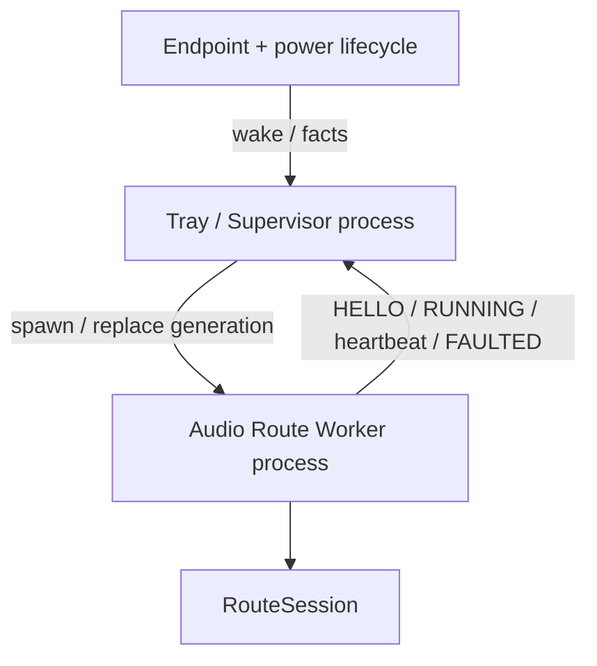
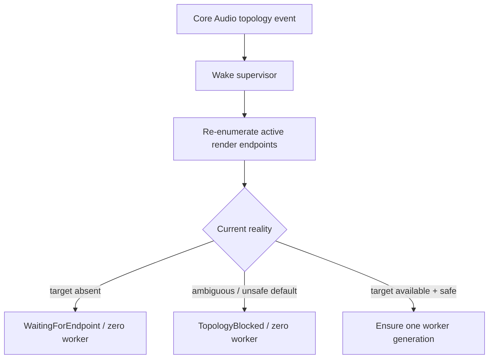

# How it works

LE Audio Router is intentionally built as a small set of explicit ownership boundaries.

At a high level:

```text
Windows applications
    ↓
sacrificial physical render endpoint
    ↓
Process Loopback capture
    ↓
PCM relay boundary
    ↓
persistent LE Audio render
```

The long-lived tray process supervises that route but does not contain the route itself.

---

## Process model

There are exactly two runtime process roles:

```text
Tray / Supervisor
Audio Route Worker
```



### Tray / Supervisor

Owns:

- application lifetime;
- tray UI;
- current route configuration;
- endpoint observations;
- power observations;
- worker generation replacement;
- low-volume lifecycle logging.

It does **not** own:

- the destination AudioClient;
- Process Loopback callbacks;
- the PCM ring;
- route-local render state.

### Audio Route Worker

One worker PID represents one disposable route generation.

It owns:

- one destination endpoint instance;
- one persistent destination render stream;
- one Process Loopback capture stream;
- one PCM ring;
- route telemetry;
- the temporary positive-drift guard.

Destroying the worker therefore replaces the entire user-mode audio generation at once.

This is a recovery and diagnostic boundary, not a kernel/driver isolation boundary.

See:

- [ADR 0001](decisions/0001-out-of-process-route-generation.md)

---

## Why a sacrificial Windows output exists

Normal applications do not render directly to the LE Audio destination in this design.

Instead:

```text
Windows default output
    = separate physical sink

LE Audio destination
    = owned continuously by LE Audio Router
```

Typical default sinks:

- NVIDIA HDMI/DisplayPort audio;
- Realtek analog output;
- another stable physical endpoint.

This lets ordinary applications create and destroy their own render streams without controlling the lifetime of the final Buds AudioClient.

The physical sink is called "sacrificial" because its audible output is not the product goal. Its job is to remain a stable Windows render target whose mix can be captured.

---

## Process Loopback capture

Windows Process Loopback can capture render audio associated with a process tree or exclude a process tree.

LE Audio Router uses the worker PID in:

```text
ExcludeTargetProcessTree
```

Conceptually:

```text
capture:
    all ordinary application render streams

exclude:
    LE Audio Router worker
    worker child processes
```

That prevents the worker from capturing its own Buds render output and creating a feedback loop.

Microsoft references:

- https://learn.microsoft.com/en-us/windows/win32/api/audioclientactivationparams/ne-audioclientactivationparams-process_loopback_mode
- https://learn.microsoft.com/en-us/samples/microsoft/windows-classic-samples/applicationloopbackaudio-sample/

---

## Route format

The current route is deliberately strict:

```text
48,000 Hz
Float32
2 channels
```

The destination MixFormat is validated before the route starts.

The current daily path is not a general resampling/mixing engine. If the destination does not expose the expected format, startup fails rather than silently introducing more conversion behavior.

---

## Destination-first startup

The destination starts before capture.

Current sequence:

```text
resolve destination
→ validate route format
→ create PCM boundary
→ create persistent renderer
→ create Process Loopback capture
→ start destination render
→ wait for destination activation
→ arm PCM boundary
→ start capture
→ RUNNING
```

The current activation wait is approximately 250 ms.

The worker sends `RUNNING` to the supervisor only after the real RouteSession has started successfully.

---

## KEEPALIVE → ARMED → RELAY

The PCM boundary has three startup states.

### KEEPALIVE

The destination is already rendering.

Every output buffer is cleared to real zero PCM.

No captured application audio is consumed yet.

### ARMED

Capture starts filling the ring.

The boundary waits until enough data exists for:

```text
current render request
+
target retained cushion
```

With a typical ~10 ms render request and the current 10 ms cushion, activation occurs around ~20 ms pre-render fill.

### RELAY

After the current render request is consumed, the intended retained queue is approximately:

```text
10 ms
```

That retained cushion absorbs ordinary scheduling/phase variation between capture and render callbacks.

---

## Why real zero PCM matters

The keepalive stream does not stop rendering during silence.

Instead, the destination provider returns a complete zero-filled buffer.

That means:

```text
application silence
!= destination AudioClient teardown
```

This is the central behavioral invariant inherited from the original V0.1 experiment.

---

## Endpoint lifecycle

Core Audio endpoint notifications are treated as **wake-up signals**, not authoritative state.

```text
notification
    = something changed

fresh enumeration
    = what is true now
```

Why?

Bluetooth reconnect can generate several add/remove/state-change events while Windows rebuilds endpoint topology. Basing policy directly on event ordering would make the supervisor unnecessarily fragile.

Current flow:



See:

- [ADR 0002](decisions/0002-event-driven-endpoint-reconciliation.md)

---

## Windows suspend/resume

Sleep is treated as a route-generation boundary.

The tray owns a small hidden native window that receives `WM_POWERBROADCAST`.

The callback does not touch WASAPI objects. It only updates a power fact and wakes the supervisor.

```text
suspend
→ IsSuspended = true
→ SuspendCount + 1

resume
→ IsSuspended = false
→ PowerRevision + 1
```

Each worker generation records the PowerRevision under which it was created.

After resume:

```text
worker.PowerRevision != current.PowerRevision
    => generation is stale
    => replace it
```

The project therefore follows this invariant:

> A route generation is never trusted across a Windows suspend/resume cycle.

See:

- [ADR 0003](decisions/0003-power-revision-route-invalidation.md)

---

## Worker fault recovery

When topology is valid but a worker or route fails, recovery uses bounded backoff:

```text
1 s
2 s
5 s
10 s
30 s
30 s ...
```

This is intentionally different from endpoint absence.

### Endpoint absent

```text
zero workers
wait for topology change
```

### Endpoint present but route fails

```text
RecoveringFault
bounded retry
```

That distinction replaced the V0.20.1 behavior, which retried every three seconds regardless of whether the earbuds were physically available.

---

## Render category

The worker can create the destination stream using:

- GameEffects
- GameMedia
- Media
- Default / unset

Microsoft documents these as Windows audio stream categories that describe intended stream use and can map to driver audio-processing modes.

Reference:

- https://learn.microsoft.com/en-us/windows/win32/api/audiosessiontypes/ne-audiosessiontypes-audio_stream_category

GameEffects is the current project default because it performed best in comparative daily testing on the primary test system.

That is an empirical project choice, not a claim that GameEffects is universally optimal for LE Audio.

---

## Current buffering

```text
Capture buffer           10 ms
Target residual cushion  10 ms
Startup hold limit       40 ms
Physical ring capacity   80 ms
```

The physical ring capacity is intentionally larger than the operating target.

```text
80 ms
    = safety storage

10 ms
    = intended retained queue
```

---

## Provisional positive-drift guard

Process Loopback production and destination rendering do not currently share an explicit application-level clock controller.

Over long runs, a small positive producer/consumer mismatch can make retained ring fill rise.

The current temporary guard regulates **post-render residual fill**:

```text
target residual       10 ms
gradual trim stops    11 ms
gradual trim starts   12 ms
hard recenter         20 ms
physical capacity     80 ms
```

Correction order:

1. if the source reports silence, suppress already-accumulated excess first;
2. under continuous audio, discard one complete stereo sample frame every eight render callbacks while residual fill remains above the hysteresis band;
3. if residual reaches 20 ms, hard-recenter to the 10 ms target.

This is not a PLL, ASRC, drift estimator, or final clock-synchronization design.

See:

- [ADR 0004](decisions/0004-provisional-positive-drift-guard.md)

---

## Telemetry semantics

The project deliberately separates:

- captured audio frames;
- captured silent frames;
- startup drops;
- runtime audio drops;
- runtime silent drops;
- startup trim;
- silent clock trim;
- gradual clock trim;
- emergency clock trim;
- render zero-fill;
- callback errors.

This exists because an early V0.1 `OverflowFrames` counter mixed silent-frame loss with potentially audible loss and therefore exaggerated the product meaning of the number.

Intentional clock correction is not counted as ordinary runtime overflow.

---

## Lifecycle journal

Persistent lifecycle logs are intentionally low-volume.

Path:

```text
%LOCALAPPDATA%\LEAudioRouter\logs\lifecycle-YYYY-MM-DD.log
```

Recorded:

- app start/exit;
- endpoint availability transitions;
- topology blocking;
- suspend/resume;
- worker running/replacement/exit;
- mode changes;
- manual restart.

Not persisted:

- heartbeat;
- ring fill;
- overflow warnings;
- drift warnings;
- per-second telemetry.

Persistent logging never runs on an audio callback path.

---

## Failure-boundary interpretation

The worker process also provides a useful debugging experiment.

If replacing the worker clears a fault:

```text
process-local route state
    becomes more plausible
```

If a fault survives worker replacement:

```text
state below the worker boundary
    becomes more plausible

examples:
    Windows Audio services
    Bluetooth stack / driver state
    controller state
    earbuds
```

This is evidence, not automatic root-cause proof.

---

## What remains future work

The current architecture intentionally leaves several things open:

- proper bidirectional clock-drift estimation;
- negative-drift control;
- crossfaded or perceptually safer sample slip;
- PLL / ASRC;
- broader device compatibility;
- packaging/installer;
- richer explicit diagnostics;
- any future own-stack/WinUSB controller work.

The daily-use relay should remain understandable even if those features are added later.
